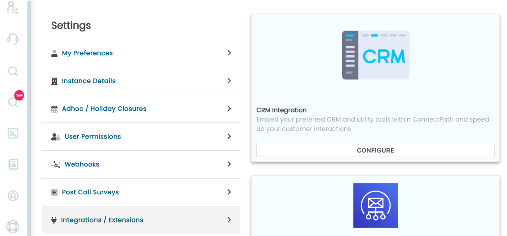
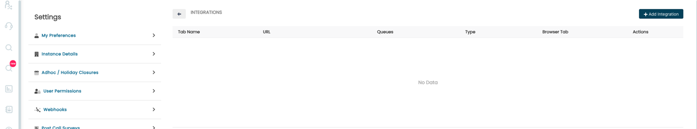
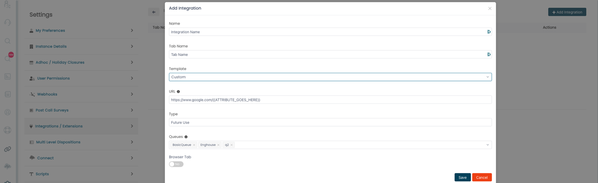
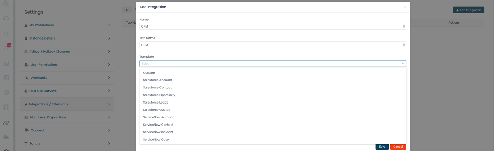
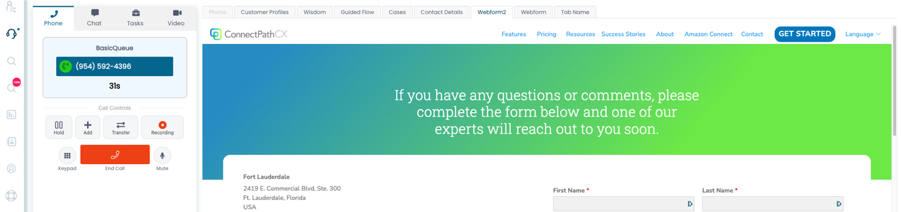
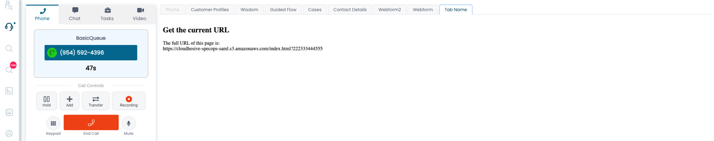
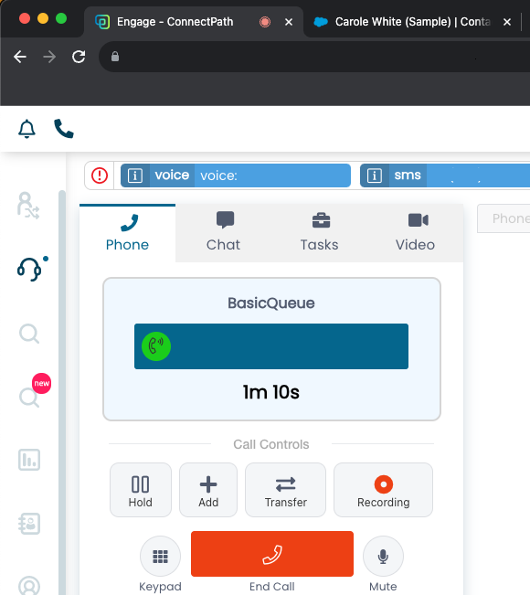

### CRM Integration

ConnectPath supports fetching resources from external services, such as
Customer Relationship Management (or CRM) systems. This fetch may
consist of embedding the service within a tab in the Engage page of
ConnectPath or opening the URL to the service in a new browser tab.
Further, part or all the URL to the service may be substituted with the
value found in one or more attributes, to form complex URLs.

Common examples of this include opening records in Salesforce,
ServiceNow or even a custom application.

To get started, go to Settings, Integrations and click the Configure
button under CRM Integration:

This will show you previously configured CRM Integrations or allow you
to create new CRM Integrations by clicking the Add Integration button:

To add an integration, click the Add Integration button and you will be
prompted to enter the following details:

Name is the name of the integration, the Tab name is the name that will
be displayed if the integration is not configured to open in a new
browser tab and Type is for future use (grouping of like integrations).

The Template drop down allows you to select from pre-defined URL
patterns commonly used in Salesforce and ServiceNow, but does not limit
you to those patterns -- you may start with them and edit under the URL
field:

The URL field itself supports full substitution with attributes
previously defined in Contact Flows, encased in double curly braces. For
example, if you had a customerId attribute set in a contact flow you
would reference it as {{customerId}}. If you wanted to pass it to an URL
of <https://app.sample.com?id=>, the full URL field would look like
[https://app.sample.com?id={{customerId}}](https://app.sample.com?id=%7b%7bcustomerId%7d%7d).

The attributes themselves, in the Contact Flows, may make use of Lambda
based integrations and/or customer Profiles to resolve details such as
the caller phone number to an ID value known by the CRM integration (an
example of this would be looking up the callers phone number and getting
their Salesforce record ID using the Amazon Connect Salesforce Lambda
Package available here:
<https://github.com/amazon-connect/amazon-connect-salesforce-lambda>.

The final two options that may be configured are which queues the
integration should apply to and whether the URL should be opened within
ConnectPath or in a new tab. The application's compatibility with
embedding will determine the later -- Salesforce, for example needs to
be opened in a new tab, whereas Microsoft Dynamics does not.

Once configured, your integration configuration will look like this:

After that you may test the integration by initiating a contact, in the
examples below this is an inbound voice call.

An application embedded in a tab of ConnectPath looks like this, and in
this case we have not passed any attributes and simply opened the URL to
the application:

A simple sample application that simply passes the values of the
attributes looks like this:

The sample code to display this page is as follows:\
\
\<!DOCTYPE html\>

\<html\>

\<body\>

\<h2\>Get the current URL\</h2\>

\
\</p\>

\<script\>

document.getElementById(\"demo\").innerHTML =

\"The full URL of this page is:\<br\>\" + window.location.href;

\</script\>

\</body\>

\</html\>

Finally, an example of an application opened in a new browser tab looks
like this:

This concludes the configuration and validation of the CRM Integration
and your ConnectPath users may begin using it.