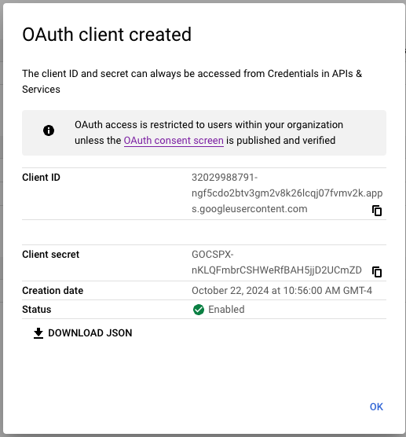

Configuring Google OAUTH for Outbound E-Mail

This document will walk you through configuring Google (Workspace) so
that you may use OAUTH to send E-Mail from ConnectPath (versus Basic
Authentication).

 

[Create a Project]

 

Browse to <https://console.cloud.google.com/projectcreate>

 

 

[Enable Gmail API]

 

Browse to
<https://console.cloud.google.com/marketplace/product/google/gmail.googleapis.com>

 

 

(screenshot may vary)

If the page shows manage, permissions have already been granted for use
of the Gmail API, otherwise, grant permissions for use of the Gmail API.

 

[Create OAuth consent screen]

 

Browse to <https://console.cloud.google.com/apis/credentials/consent>

 

 

Select Internal

 

You may specify any name, user support email, and developer contact
information, but you must specify the following authorized domains:

 

 

[Create Credentials]

 

Browse to <https://console.cloud.google.com/apis/credentials>

 

 

Select OAuth Client ID

 

 

Select application type Web application

 

 

Specify origins and URIs and click Save

 

 

Note the Client ID and Client secret above

 

[Create Refresh Token]

 

Browse to <https://developers.google.com/oauthplayground>

 

 

Click the gear on the top right, click the checkbox "use your own OAuth
credentials", enter the Client ID and Client Secret noted in previous
step and then click close.

 

 

Expand Gmail API v1 and then select <https://mail.google.com> and click
Authorize APIs

 

 

Select the Workspace account you wish to use.

 

 

Click Allow

 

 

Click Exchange authorization code for tokens

 

 

Click refresh access token

 

Go back to Step 2

 

 

Copy the Refresh token

 

Go to ConnectPath \> Settings \> Integrations and click Google OAuth 2

 

 

Enter the Client ID, Client Secret and Refresh Token noted on the
previous screens and click Save (or Update)

 

 

You may now create (or update) the Webhook to use Google Suite OAuth for
sending E-Mail from ConnectPath

This completes the steps required to configure Google (Workspace) so
that you may use OAUTH to send E-Mail from ConnectPath (versus Basic
Authentication).
