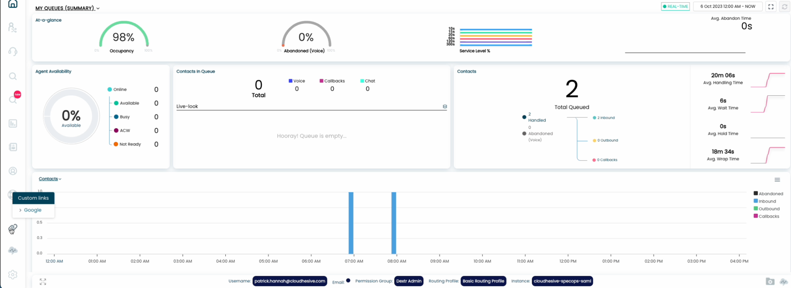
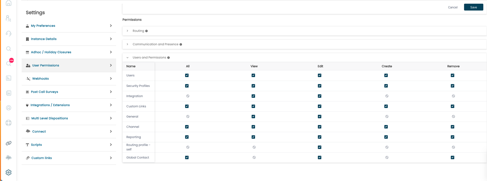
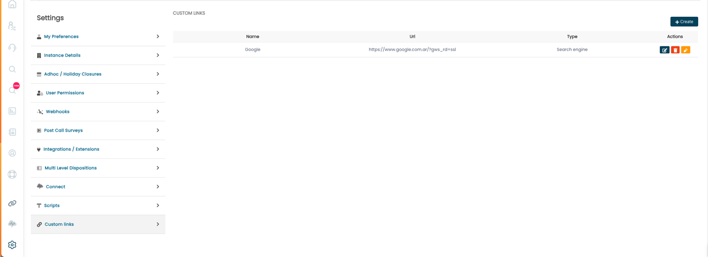
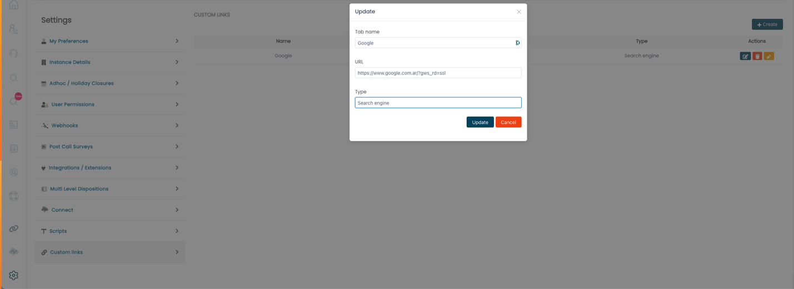

### Custom links in ConnectPath

In addition to CRM Integration, where a contact can trigger a custom URL
be opened in an Iframe within ConnectPath, or in a separate Browser tab,
ConnectPath also supports Custom links. Custom links allow customer
administrators to specify one or more links that are presented as a sub
menu under the "chain" icon on the left-hand side of ConnectPath:

Upon clicking on one of the links, the link will be opened, as-is, in a
new Browser Tab. Future capability will also allow the link to be opened
as an Iframe within ConnectPath, like how a custom URL can be opened
when a contact is received by way of the CRM Integration feature.

Maintenance of this configuration can be delegated via Custom Links set
of Permissions as depicted in the below screenshot. This permission does
not impact how a general user experiences Custom links, only the
permissions that may be delegated to a user as it relates to managing
Custom links on behalf of those users. This can be accessed by clicking
the Gear, then User Permissions, then the Permission Group that you wish
to make this permission available to:

Once the user has been given the appropriate permissions, they may
create a Custom link, update it, delete it, or test it. This can be
accessed by clicking the Gear then Custom links:

Clicking the Create button in the top right-hand corner of the screen
and you will be prompted to give the link a name, the URL, and a Type,
the later which will be used to group links in a future release. Once
done you may save, or in the case of updating an existing link, update,
or cancel to cancel the change:

This concludes the steps involved in assigning permissions to manage
Custom links, creating Custom links and accessing Custom links within
ConnectPath.
