Customizing the out of the box Reporting V2 (QuickSight) Dashboards

This document will walk you through the customization of the out of the
box Reporting V2 (QuickSight) Dashboards

To begin, you will first need to log into Quicksight.

 

Click the People menu on the top right and then click Manage QuickSight:

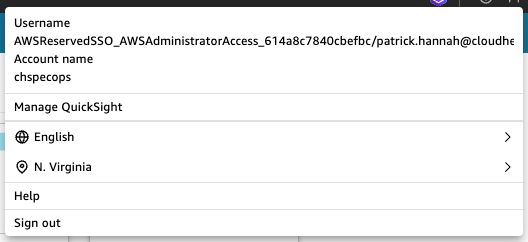

 

Click Manage Assets:

 

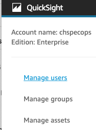

 

Click Dashboards:

 

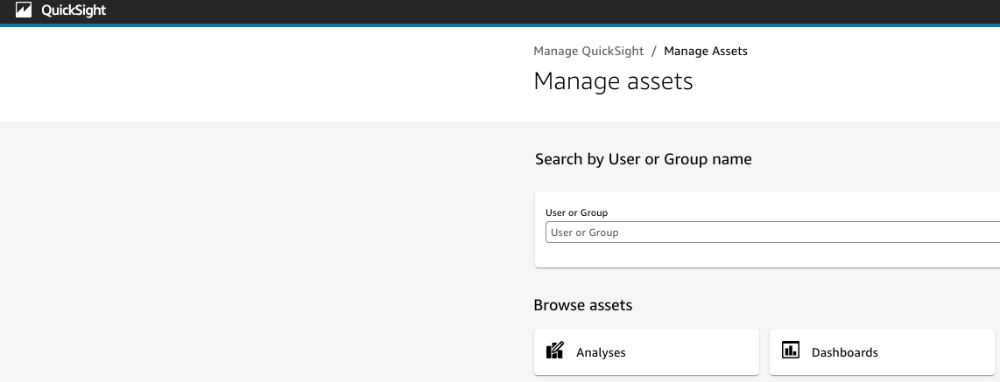

 

Select the dashboards that begin with the name of the Connect instance
you wish to manage the dashboards for:

 

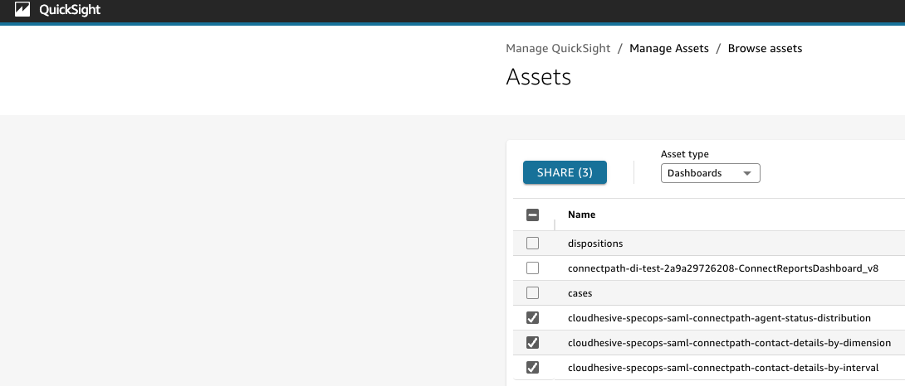

 

Click Share, Type your username, Click Share:

 

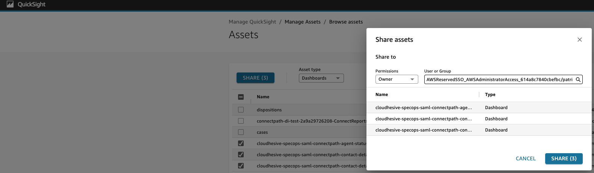

 

Click Done:

 

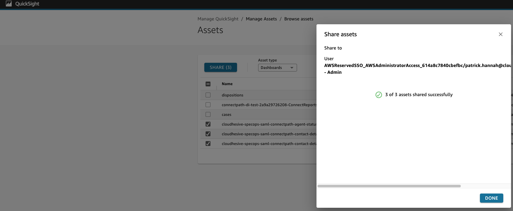

 

Click Manage QuickSight in the top left corner:

 

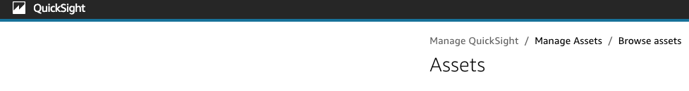

 

Click dashboards, click on the dashboard that you wish to edit the
analysis for:

 

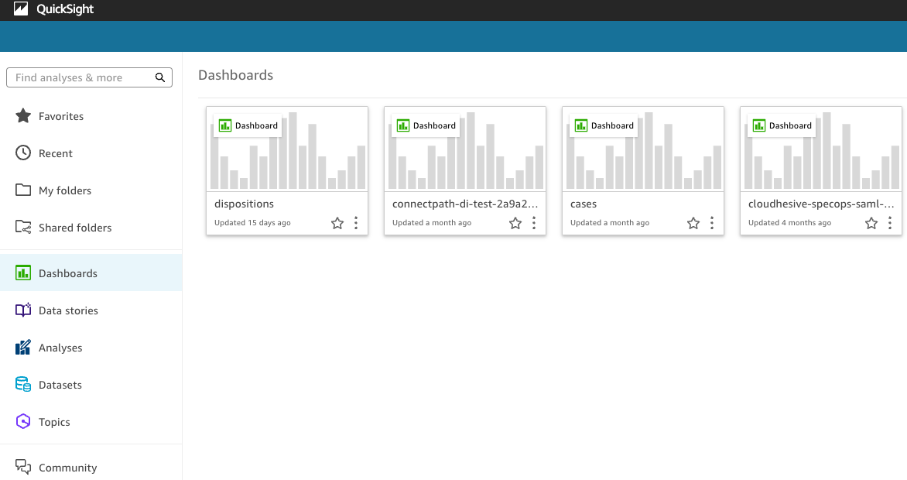

 

Click the sharing icon in the top right corner and then share dashboard:

 

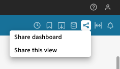

 

Find your user, click on the allow save as toggle, click confirm:

 

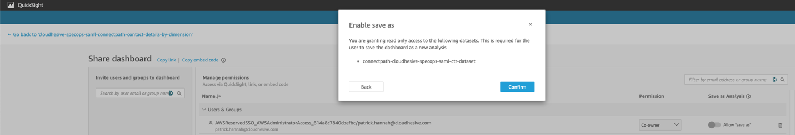

 

Wait a minute, click refresh and you will now see a disk icon. Click on
the disk icon and you are not prompted to save the analysis. Give the
analysis a name and click save:

 

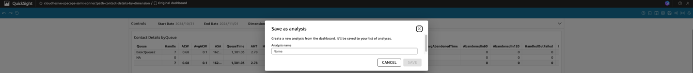

 

Make your changes, click publish, give the dashboard a name in this
format (instancealias-connectpath-NAME) where instance alias is your
instance alias and NAME is the name of the dashboard you want to be
present in ConnectPath, and click publish dashboard:

 

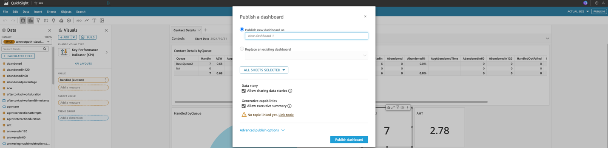

 

After the above steps are completed, you will now see the Dashboard in
ConnectPath and may assign permissions to the groups that wish to access
said Dashboard.
