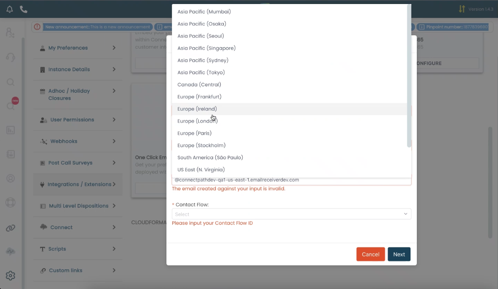
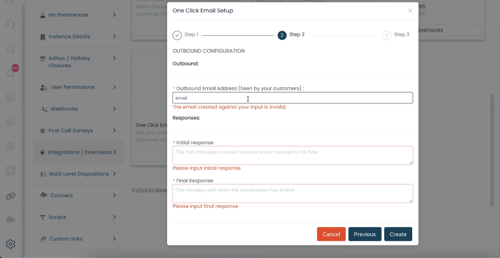
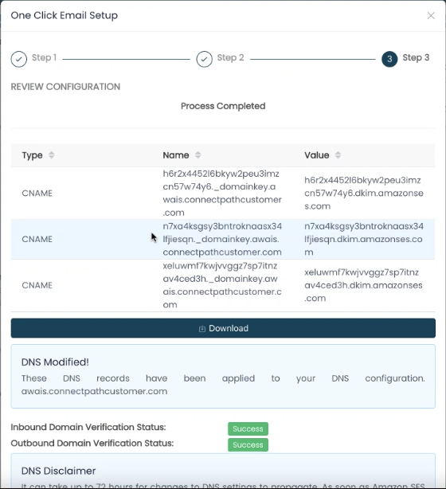
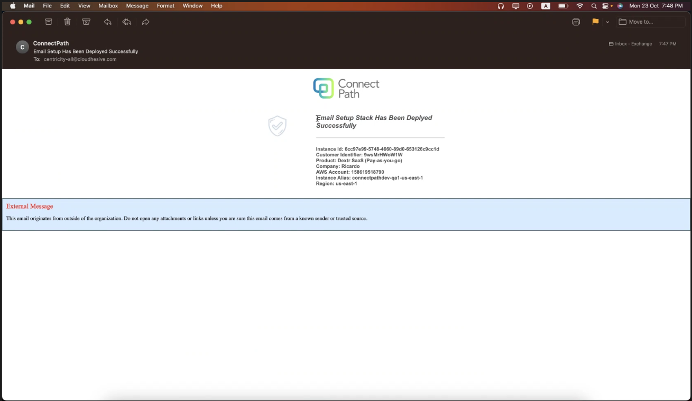
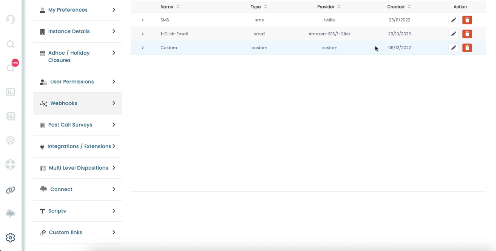
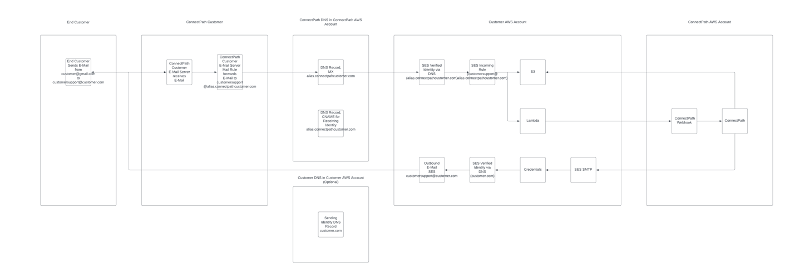

### E-Mail Wizard

The E-Mail Wizard in ConnectPath eliminates some of the manual steps
previously involved in setting up ConnectPath to receive/send E-Mails.

Specifically, it takes care of the creation of the Simple E-Mail
Services (SES) configuration for E-Mail Receiving and Sending (the
latter is especially useful when using a third party E-Mail provider
such as Office 365 or Google Workspace) as well as creation of DNS
records required to authenticate your domain and handle E-Mail routing
to SES (in the event you use Route53 as your DNS provider and it is in
the same AWS account as your Connect instance).

When you start the E-Mail Wizard the first step will prompt you to
select the region that you wish to setup SES in. This region will
typically be the region your Connect instance is in, but if the SES
capability is not in a region that your Connect instance is in, we have
provided the flexibility to select an alternative region.

You will also be prompted to provide a receiving E-Mail Address as well
as a Contact Flow that should be used for routing the E-Mail to your
users. This E-Mail Address will be what you typically forward your
public E-Mail Address to, and any Contact Flow that is compatible with
Tasks is suitable for routing the E-Mail to your users.

In the second step, you will be prompted to enter an outbound E-Mail
Address. This is the E-Mail that your customers will see and will
generally be the E-Mail Address you are forwarding E-Mail from.

Initial response and final response are auto responders that will be
received by the customer when they first send an E-Mail to you and when
the contact has been terminated by the agent, concluding the
interaction.

Finally, on the last step, ConnectPath will attempt to create DNS
records on you behalf and if it is unable to it will provide instruction
on which records need to be created. As DNS propogation is not
immediate, visual indicators are also provided to confirm when DNS has
been propogated and DNS ownership has been validated by SES:

ConnectPath will deploy the above configuration with CloudFormation and
once the Stack has been deployed, the ConnectPath instance
administrators will receive an E-Mail indicating the same:

After the Wizard has been completed, the E-Mail Webhook will be
displayed under Webhooks, similar to the manual process, and further
customization may be performed, if needed:

At this point you may validate the Configuration and Contact Flow by
sending an E-Mail to the Inbound E-Mail Address you entered in the first
step. The expected result is that the E-Mail will be converted to a Task
and routed to an agent, the agent can respond successfully, and the
original sender receives that response. Upon validation of the
configuration, you may forward your customer-facing E-Mail Address to
the Inbound E-Mail Address.

To summarize, the end-to-end flow of E-Mail, once the above steps have
been completed, will look like this:

This concludes the setup of E-Mail using the E-Mail Wizard.
