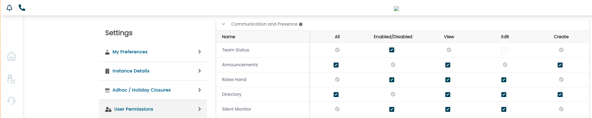
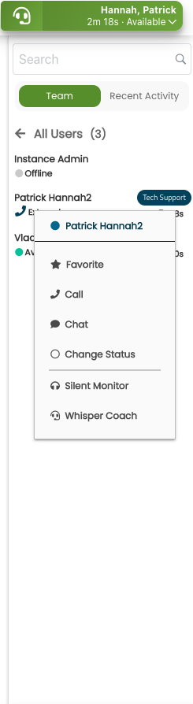
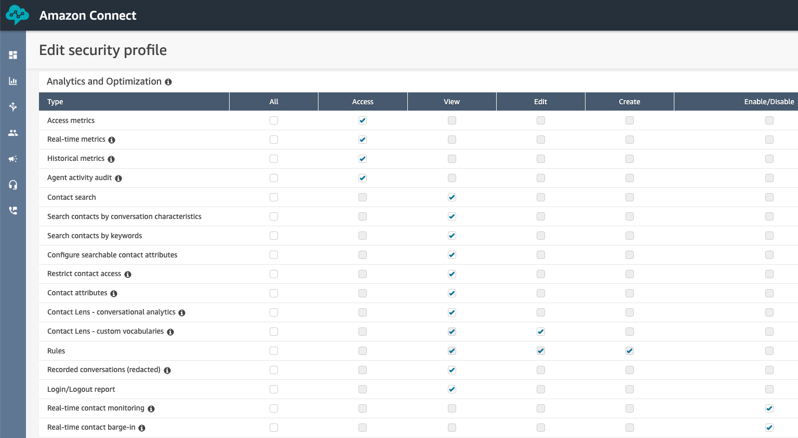
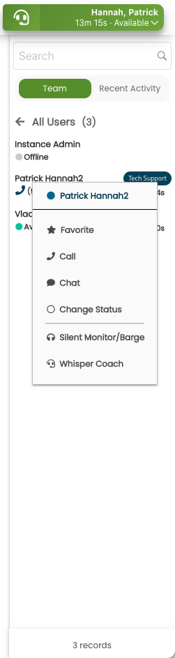
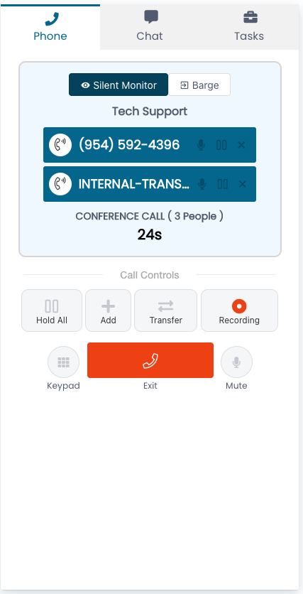
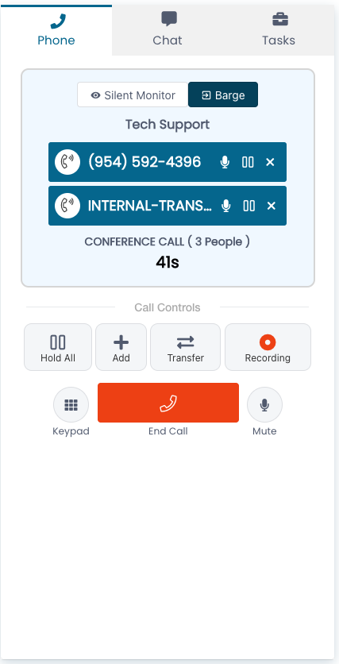
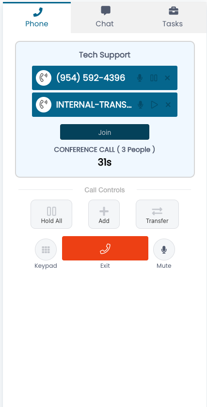

Enabling Native Amazon Connect Silent Monitoring and Barge-In

ConnectPath now supports Native Amazon Connect Silent Monitoring and
Barge-In. Before the introduction of this feature, ConnectPath supported
Custom Monitoring and Whisper, which was specific to ConnectPath. Native
Amazon Connect Silent Monitoring and Barge-In might be preferable to the
Custom Monitoring and Whisper capabilities implemented in ConnectPath as
it utilizes the familiar Engage user interface to control the session
and utilizes existing Amazon Connect infrastructure, which may be
preferrable in certain customer configurations. ConnectPath will
automatically detect the Instance Configuration and Amazon Connect User
Permissions prior to displaying these options and regardless of which of
the options is preferred, the User Permission for Silent Monitor must
also be enabled.

To get started, you will want to check that the User Permission has been
set for the users you wish to be able to either approach (referred to as
supervisors throughout this document):

Upon enabling this permission, supervisors will see the following when
right-clicking on an agent, on a call, under the Team Status drawer.
Note that two options are present, Silent Monitor and Whisper Coach,
which indicates the permission was set correctly but either the Amazon
Connect Instances does not have Monitor and Barge-In enabled or the
supervisor is not in an Amazon Connect Security Profile that enables
access to these features:

To enable these features, you'll first need to enable the Native Amazon
Connect Monitoring and Barge-In capabilities by going to the AWS
Console, selecting the Amazon Connect Instance you wish to enable this
feature on, and checking the box under Enhanced calling and monitoring
capabilities labeled "Enable Multi-Party Calls and Enhanced Monitoring".
Enabling this will also enable your Amazon Connect Instance to support
Multi-Party Calling, which ConnectPath will take advantage of within the
Engage page. Depending on the vintage of your Amazon Connect Instance,
you may have additional steps you will need to follow, which are covered
under
<https://docs.aws.amazon.com/connect/latest/adminguide/monitor-barge.html>.

Supervisors who wish to use this feature will also need their Amazon
Connect Security Profile(s) updated to provide permissions to Real-time
contact monitoring and Real-time contact barge-in:

After both changes have been made, when a supervisor right clicks on a
user who is on an active call in the Team Status Drawer, the options
will be different. In this case, Silent Monitor/Barge and Whisper Coach
are displayed instead. Selecting Silent Monitor/Barge will utilize the
Native Amazon Connect functionality whereas Whisper Coach will utilize
the Custom ConnectPath functionality:

Upon Clicking Silent Monitor/Barge, the supervisor will see the
following on the Engage Page, receive an Auto-Accepted Contact and be
placed in a busy status:

The supervisor may then click Exit to end the Silent Monitor session or
Barge to introduce themselves into the call, as if they were conferenced
in. Upon clicking Barge, the supervisor will see the following options:

Note that Exit turns into End Call, and additional options are enabled
for the supervisor, again, enabling them to participate in the call as
if they were conferenced in.

When the supervisor enables Barge, the agent will note their Engage page
changes as well, again, as if the supervisor were conferenced in,
however, the agent may proceed to handle the call as if it were any
other conference call and additional actions are not required on behalf
of the agent:

That concludes the configuration and usage of the Native Amazon Connect
Monitoring and Barge-In capabilities.
