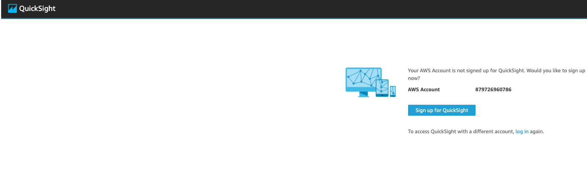
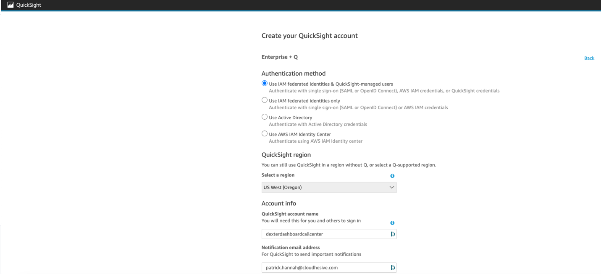

Historical Reports V2

ConnectPath now supports a new version of Historical Reports. This
version represents a significant change in how historical data is
ingested and made available (stored) for reporting within ConnectPath.
Data storage continues to remain within the same AWS Account and Region
as your Amazon Connect Instance.

To facilitate the setup of this new feature, two new Integrations have
been provided, "Datalake Powered by Amazon Athena" and "Historical
Reports V2" Powered by Amazon".

The first is responsible for creating the ingestion services (Kinesis),
storage services (S3) and retrieval services (Athena), along with the
views within Athena that will take the raw data and format it for use in
the reports. The later provides full transparency and customizability to
privileged users to understand the formulas/calculations used in the
reports as well as create their own sources of data and corresponding
reports based on that data.

The second integration card is responsible for deploying an embedded
version of Quicksight, which is responsible for taking the output of
Athena and displaying it to users within ConnectPath. Note that this
requires an Enterprise+Q Plan with Quicksight. Much like the flexibility
offered by Athena, privileged users have full control over the data
sources, calculations, data elements and visual presentation of said
information within ConnectPath.

Initially we are supporting Amazon Connect CTR and Agent Event Data
sources and are providing 3 Dashboards (Reports) based on this
information, but we will be able to make available, by request and
proactively, updates to these integrations in which additional data
sources and Dashboards are available.

Similarly, most of the setup is a one-time activity and is automated,
though there are some manual steps which are described below.

The structure of the data is designed to provide consistency as data
grows within the data lake by use of Partitions (which are updated
daily) and data is cached within Quicksight using SPICE, which is
refreshed hourly. Existing Dashboards can be customized within
Quicksight, or even new dashboards can be created within Quicksight and
permissioned to ConnectPath.

Note that there are two implications to deleting this integration. The
first is that the baseline Kinesis streams need reconnected to the
Amazon Connect Instance. When this integration is deployed, the
deployment handles updating the Amazon Connect Instance with the new
Kinesis streams, but the same is not true for deletion of the
integration. The second consideration is that the S3 bucket, which forms
the basis of the data lake is not force deleted if there is data
present. This is intended to retain the data in the event the
integration is reenabled.

This new feature is being made available as an open preview to all
privileged users of ConnectPath, with the intent to solicit feedback on
how the setup process and the resultant reports can be positioned to
best benefit our customers. Future releases (which can be performed out
of band of our typical application release cycle) will include
additional data sources and dashboards.

The prior version of Historical Reports will still be available, and in
the longer term it will be disabled for new instances as a default, with
the option for existing instances to disable them as well. As part of
this a migration path will be provided.

This document is divided into initial setup steps and usage of the
primary functions of the feature.

Feature Setup

To setup the feature, go to Settings \> Integrations:

Under the Datalake Powered by Amazon Athena Card, click Deploy. The
status will change to Deploying:

This process will take approximately 10 minutes and once complete it
will a status of Deployed:

Once deployed, you will need to log into the AWS Console and go to the
Athena Service Console for the region that your Amazon Connect instance
is in. If your region is in us-east-1, for example, you can use this
URL:
<https://us-east-1.console.aws.amazon.com/athena/home?region=us-east-1#/query-editor/saved-queries>

Once that page has loaded, you will need to switch your Workgroup to the
one created by the ConnectPath deployment (which will have connectpath
in the name). Once done you will see two saved queries:

Each of these saved queries will need to be run once. To do that, click
on a query and you will be taken to another screen to execute that
query. The first query may prompt you to acknowledge that this query is
associated with the Workgroup that you previously changed to:

Once you acknowledge this, click the Orange Run button:

Repeat for the second query located under the saved queries tab, which
is the last step required for setup of the Datalake.

While in the AWS Console, you will also need to setup the pre-requisites
for Quicksight, which can be done by going to
<https://quicksight.aws.amazon.com/> and completing the following steps.

When you go to the QuickSight console, you will be prompted to Sign up
for QuickSight, which you may do so by clicking the button labeled as
such:

On the next screen, you will select Enterprise + Q:

On the next screen, you will enter your contact information. Note this
information for later as you will need it when you setup Quicksight in
ConnectPath:

After you click Continue, you will be prompted to sign up for an
unnecessary add on, for which you may click No, Maybe later:

Finally, on the last screen, you will select the region (which should be
the same region as your Amazon Connect instance), a unique name for the
QuickSight account (which you will need to note for later), a
notification E-Mail Address, and finally, what data QuickSight should
have access to. On that last part, click Select S3 buckets:

From the bucket list, select the ones with datalake in the name by
checking the boxes to the left and the right:

Click Finish and Click Finish again. This completes the setup of
QuickSight, and you may now go back to ConnectPath.

Go to Settings \> Integrations, and under the Historical Reports V2
Powered by Amazon QuickSight Card click Deploy.

Enter the details previously provided during the QuickSight setup in
this box -- note that the E-Mail and Username can be the same but must
be unique. The Time Zone should reflect the Time Zone that your primary
report user will be based in. Once done click Deploy.

Deployment will complete within Approximately 10 minutes and once done
the Status will show Deployed, much like the Datalake Powered by Amazon
Athena Integration:

Now you may map your ConnectPath Permission Groups to specific
QuickSight reports by going to Historical Reports V2 Permissions:

This completes the initial setup of the Feature.

Feature Usage

Usage of the feature is relatively straightforward, there is a "V2" icon
on the left hand side of the ConnectPath screen which will show you all
of the QuickSight reports that you have access to:

You may either click the row, and it will open the report within
ConnectPath, or you may click Pop Out under the Action Column and it
will open the report in a new window, Separate from ConnectPath.

An example of a report can be found below:

Reporting controls can be found at the top and allow for you to make
changes to the inputs of the query, such as specifying a date range in
this place. Note that dates are not inclusive, so if you are attempting
to run a report for the current day, you will need to set the start and
end dates to the prior and next day, as an example.

Dashboards do not automatically refresh but can be refreshed by clicking
the back button and clicking back into the Dashboard. Dashboards will
also use your instance timezone when it comes to calculating any
applicable timezone offsets.

Finally, existing Dashboards can be copied, or new Dashboards created
and made available to ConnectPath from within the native QuickSight
interface, if the naming convention of the Dashboard begins with
connectpath.

This concludes the setup and usage of the Historical Reports V2 feature.
