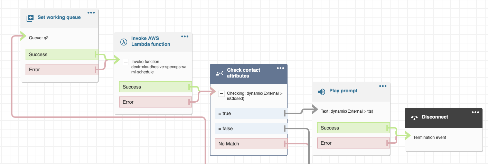
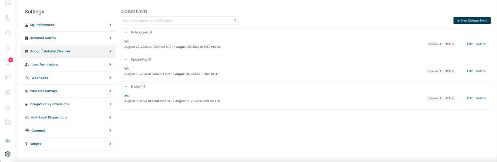
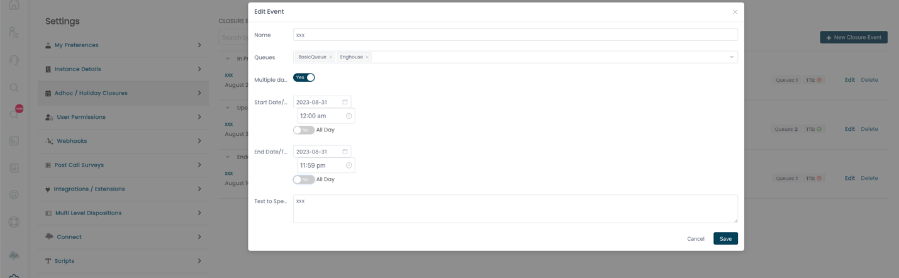
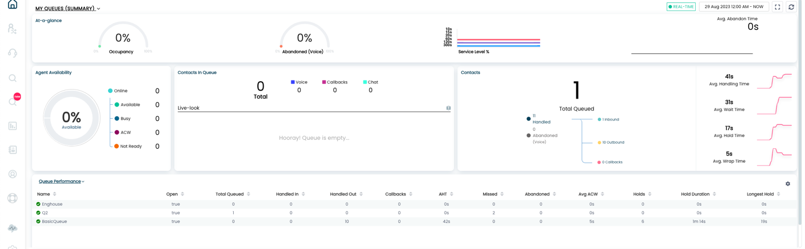

### Implementing Adhoc/Holiday Closures in ConnectPath

ConnectPath provides added functionality for administrators that wish to
set flexible schedules in their Amazon Connect Contact Flows, such as
specific dates/times or ranges of dates, typical of an organization's
holiday schedule.

This is a two-part process with the first process encompassing the
addition of a Lambda function, branch and (optional) prompt blocks
within your Contact Flows -- typically where you would check a Schedule
and the second process encompassing the creation of one or more Closure
Events.

As far as editing your Contact Flow(s) goes, this will vary based on
your specific implementation, but as mentioned above, you would
typically set this after you have determined the queue to route your
customers to, which is generally around where you would typically check
your native Amazon Connect Schedules.

This solution consists of 4 mandatory and 1 optional block. The
mandatory blocks set the queue (which you are already doing and is used
to illustrate the flow), invoking the schedule Lambda function included
in your ConnectPath deployment, checking the results of the invocation
of that function, optionally playing a text to speech prompt (which can
be set in the Adhoc / Holiday Closure in ConnectPath), and disconnecting
customers in the event the queue or queues are closed. You may customize
this to do any number of items after the branch, for example, to perform
an external transfer instead of a disconnect, or to play a fixed message
NOT defined in the Adhoc / Holiday closure.

Unlike Adhoc / Holiday closures, this is intended to be a one-time
change -- e.g. every time you create or edit an event in ConnectPath,
you do not have to edit or otherwise update the Contact Flow.

Once the blocks have been integrated into your Contact Flows, you may
move on to creating Adhoc / Holiday closure events within ConnectPath.

To access the Adhoc/Holiday Closures screen in ConnectPath, you will
first click the Gear, followed by Adhoc / Holiday Closures. On this
screen you will see Closures that are currently occurring, will occur in
the future or have occurred in the past:

For each schedule you will see a name, the date/time frame it takes
effect, how many queues are assigned, if a text to speech value has been
assigned, as well as have the option to edit or delete the schedule.

Editing a schedule will open the same modal as creating a new closure
event:

In the model you may give the event a name (or edit the current name),
select the queue or queues the event should cover (or select All to
cover all queues), indicate whether the event covers a single or
multiple days, and if it's an all-day event or not. The selection of
multiple days and or all-day toggles will display or hide additional
time fields or end dates, all of which are depicted in the screenshot
above.

You may save (or cancel your changes), and, if you choose to save you
will note they are now depicted on the main Adhoc / Holiday closures
screen.

On an ongoing basis, users with permissions to the Home screen and
related queues can see the open and close status of each queue without
needing permissions to Adhoc / Holiday closures. To do this, from the
Home screen, if you select the Queue Performance table, you'll see a
column, Open, indicating the Adhoc / Holiday closure status of the given
queue or queues:

This concludes both the initial setup, ongoing configuration and ongoing
monitoring of the Adhoc / Holiday closures feature within ConnectPath.
