### Microsoft Dynamics Integration

ConnectPath supports integration of Microsoft Dynamics integrating the
full lifecycle of the contact (from start to finish) on both the backend
(data) and frontend (agent) interfaces.

At each step of the contact (creation of the contact, termination of the
contact and availability of the recording/analysis) the appropriate
Dynamics record is created or updated. When the contact is routed to the
agent, the appropriate Dynamics record is opened in ConnectPath, either
as an embedded application or in a new browser tab.

Setup comprises three parts: Creation of an Azure AD Application
Registration, applying the correct permissions to the Azure AD
Application ID within Dynamics and configuration of the integration
within ConnectPath.

Creation of an Azure AD Application Registration.

As far as Azure configuration goes, the steps will result in you
generating a Client Secret, Client ID, and Tenant ID that you will use
to configure ConnectPath. The steps are as follows.

Note that these steps are similar if you are using Office 365 OAUTH for
E-Mail Webhook SMTP, or Microsoft Teams except for the API Permissions.

Under Azure Active Directory, go to App registrations and click New
registration:

Enter a name for this App registration and click Register.

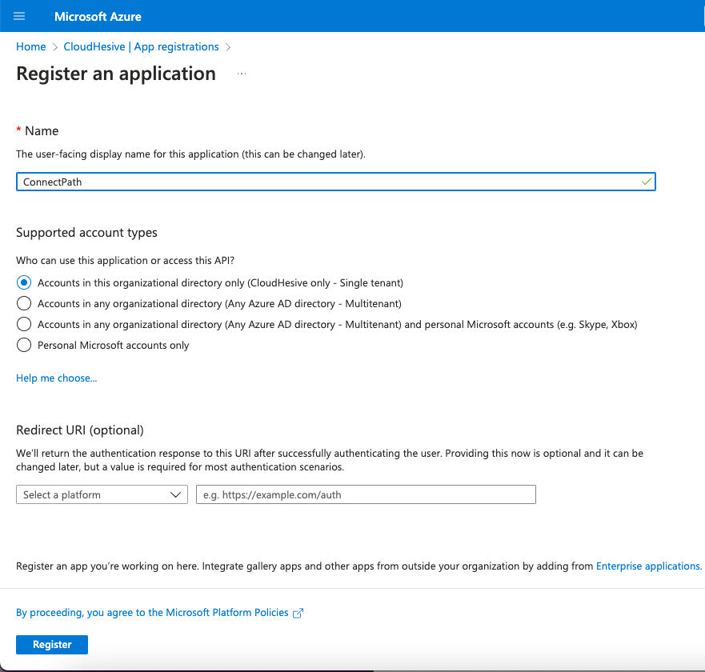

On the Overview screen of the App registration, note the Application
(client) ID and Directory (tenant) ID as you will need those when you
setup the ConnectPath portion.

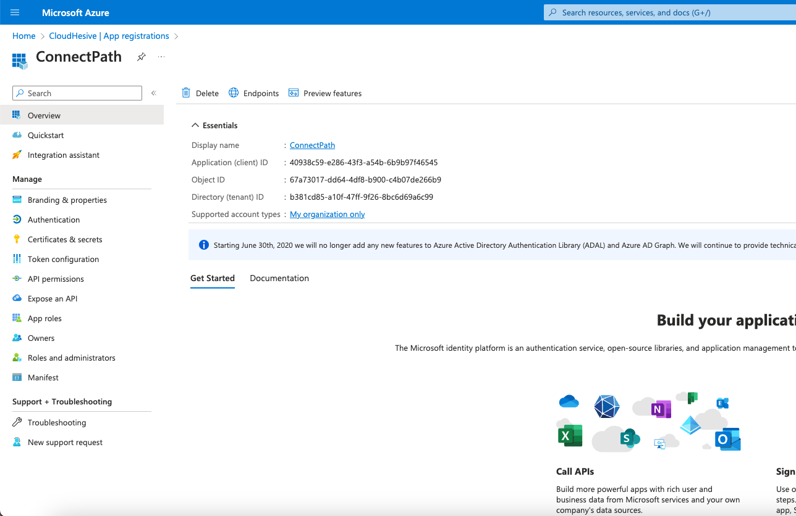

Go to Authentication and check the box for Access tokens:

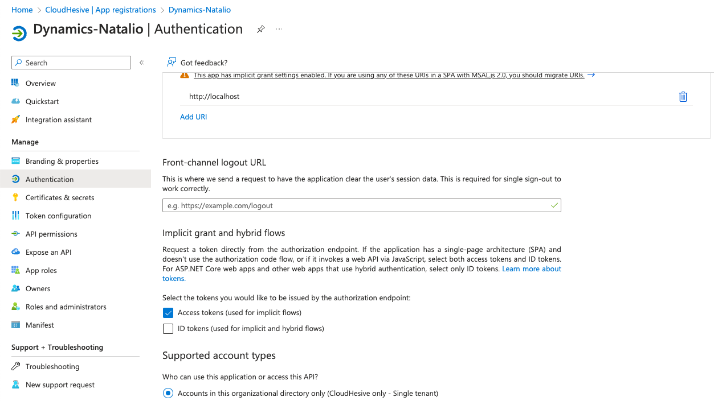

Go to Certificates & secrets and click + New client secret.

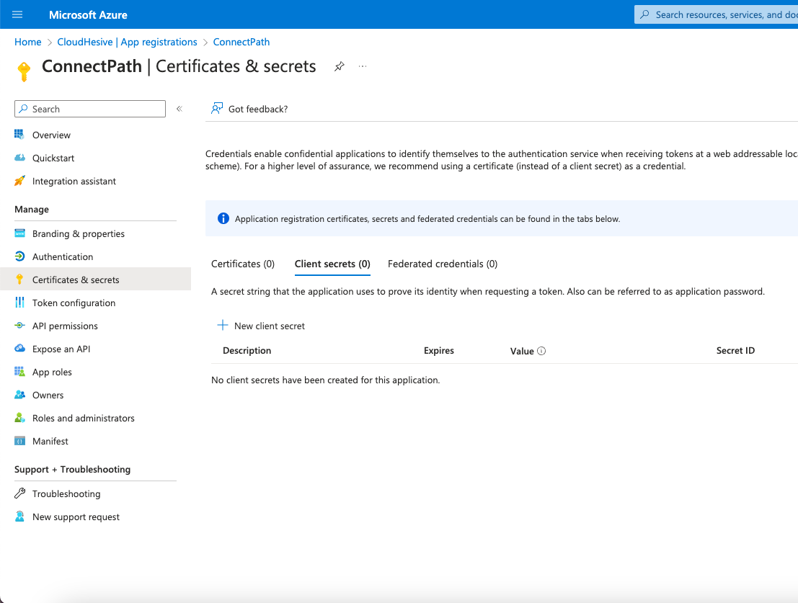

Give the client secret a name and set an expiration period (note that
you will need to generate a new client secret ahead of this expiration
period and update ConnectPath to avoid disruption when using the
Microsoft Dynamics Integration with ConnectPath).

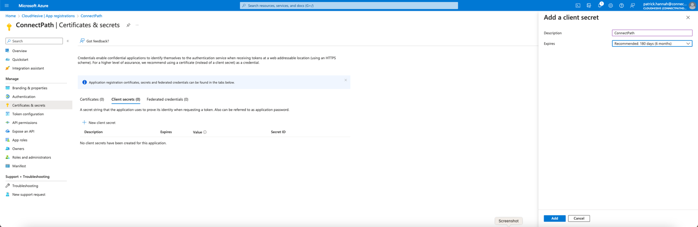

Note the Client Secret VALUE (not ID) as you will use that when you
configure ConnectPath.

Go to API Permissions, click Add a permission, select Dyanmics CRM,
select Delegated, search for user_impersonation and add it to the App.
Once added click Grant admin consent for CloudHesive. Once these two
steps are completed, your API permissions screen should look like the
following. Note the Microsoft Graph Delegated Permission of user.read
should be present by default:

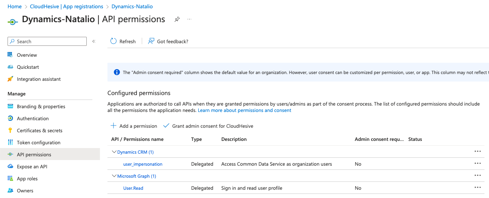

Go to Expose an API and enter and create a Default scope with Admin and
user consent. Note the Application ID URI will correspond to the Azure
AD Application Registration ID and may be populated by default.

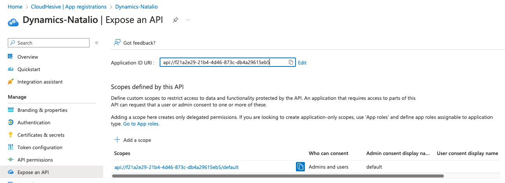

This completes the creation of the Azure AD Application Registration.

Applying the correct permissions to the Azure AD Application ID within
Dynamics.

After the Azure AD Application Registration has been completed, you will
need to apply the correct permissions to this Application within
Dynamics. To do that you will go to the Power platform admin center:

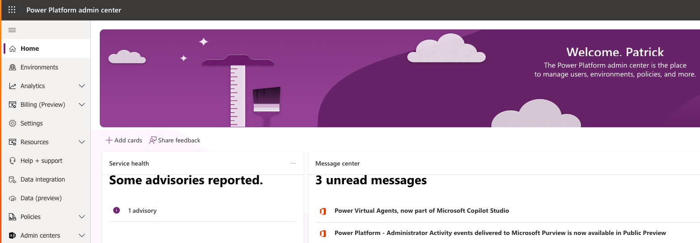

Then, you will go to Environments:

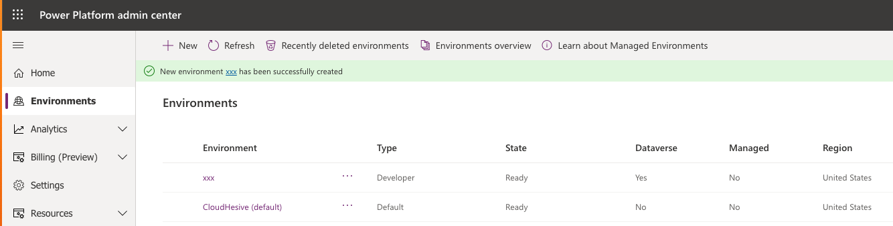

After that, you will open the Environment that you wish to integrate
ConnectPath with and click See all under S2S Apps:

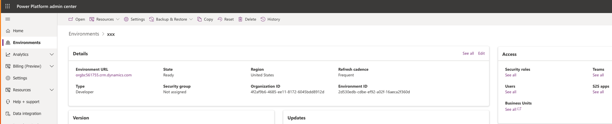

Then, you will click new App user:

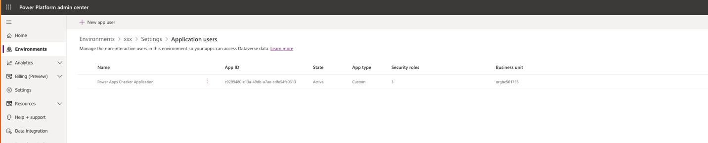

Select the Azure AD Application you previously created:

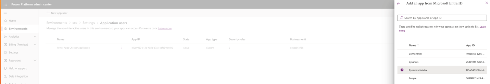

Assign the user to the appropriate Business Unit and Security role and
Click Create:

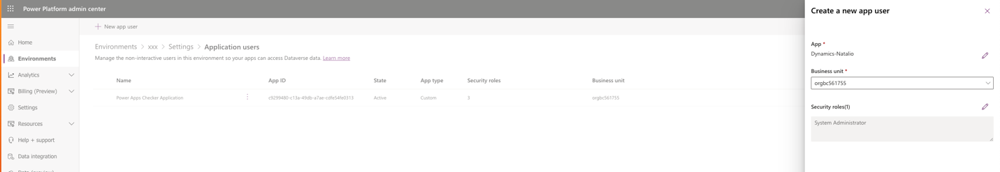

Verify that the Application user was added:

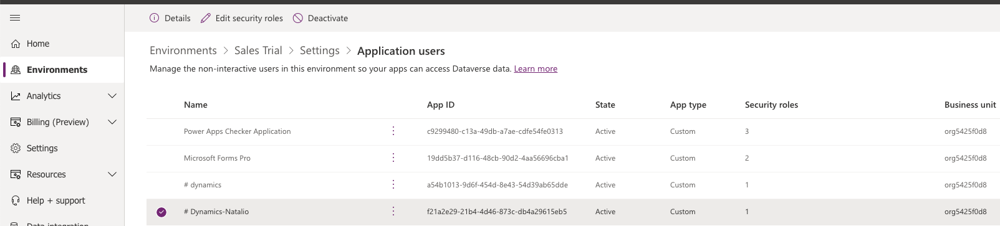

After you have completed that step, you will need to note the Dynamics
App ID (not to be confused with the Azure App ID). To get the Dynamics
App ID, log into Dynamics and use the App Switcher to find the Dynamics
App that you wish to integrate with ConnectPath. Place your cursor over
that App to get the App ID:

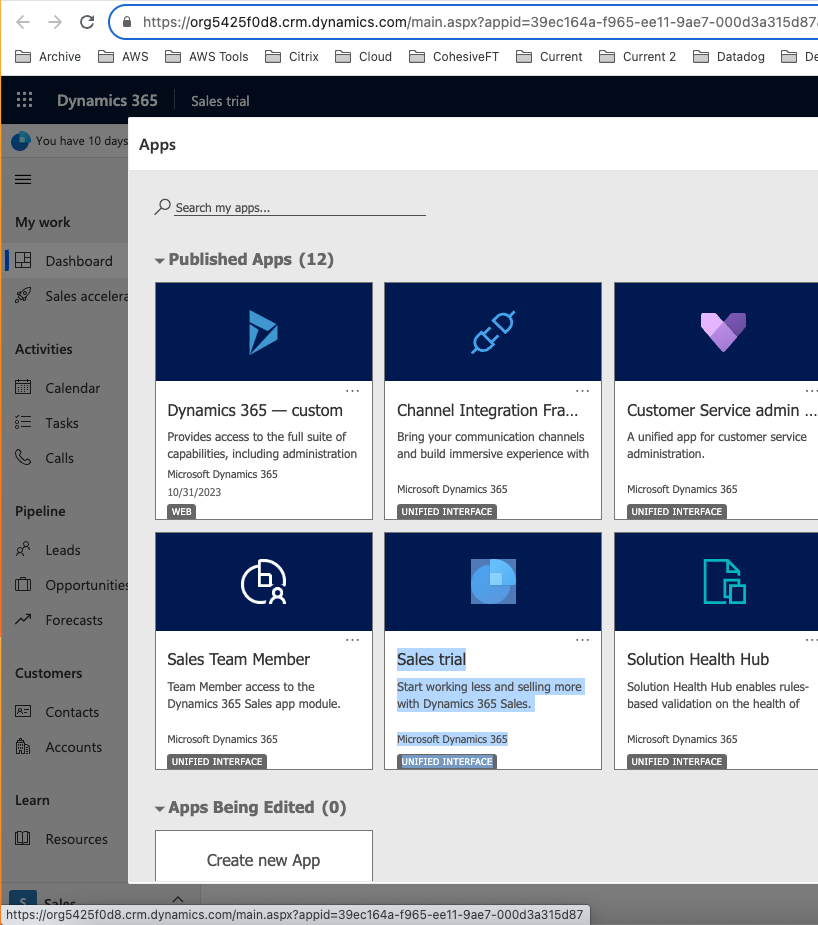

This completes the application of the correct permissions to the Azure
AD Application ID within Dynamics.

Configuration of the Integration within ConnectPath.

After the application of the correct permissions to the Azure AD
Application ID within Dynamics you may proceed with configuration of
integration within ConnectPath by following these steps:

Go to Settings, then Integrations, scroll down until you see Microsoft
Dynamics and click Configure:

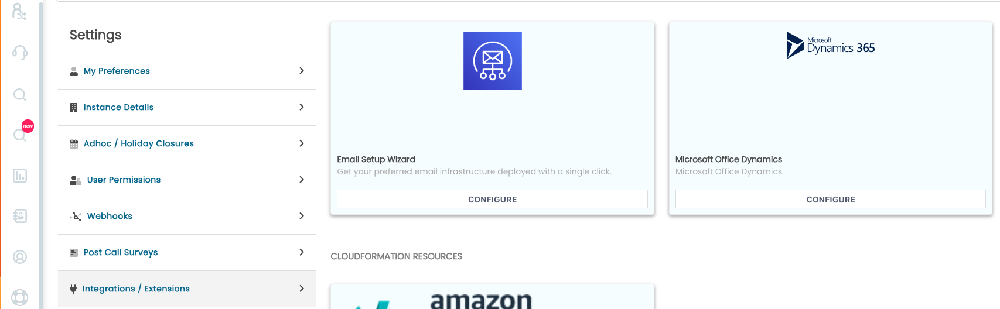

This will initiate the multi-step setup Wizard.

On Step 1 you'll provide the Dynamics environment details:

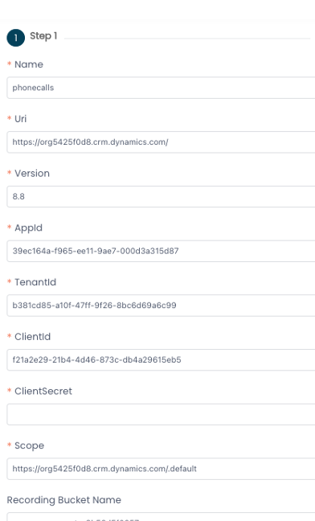

This includes the name of the integration, the Uri for the Dynamics
environment, the version of the Dynamics API that you wish to use, the
Dynamics App ID that you noted previously, the Azure AD Tenant ID,
Client ID and Client Secret that you noted previously and the Scope,
which tis the Uri with .default appended to the end. The Recording
Bucket Name is the S3 bucket that Amazon Connect stores Recordings and
Analysis (Transcripts) in.

On Step 2, you will provide the details that will be passed to Dynamics
when the contact is created. This creates the record in Dynamics,
passing the CTR attributes to the Dynamics API at the creation of the
contact. In this example we are creating a record in the phonecalls
entity that contains the customer's phone number in the phonenumber
field, the time the contact started in the actualstart field and the
subject of the phone call.

Attributes as they come from Amazon Connect must be quoted and wrapped
in double curly braces like this "{{ATTRIBUTE}}", whereas Dynamics
fields and static values only need quoted. The entire body needs to be
formatted as JSON in that multiple key value pairs are separated by
commas, a key and a value are separated by a colon and the entire body
is wrapped in curly braces.

The example below can be copied from here:

{\"phonenumber\":\"{{CustomerEndpoint}}\",\"actualstart\":\"{{InitiationTimestamp}}\",\"subject\":\"Call
between Username and CustomerEndpoint\"}

Based on your specific implementation, you may select Get, Post or Patch
methods.

Microsoft documentation around Dynamics entities can be found here:
<https://learn.microsoft.com/en-us/power-apps/developer/data-platform/webapi/reference/phonecall?view=dataverse-latest>
and documentation around OData, which is how ConnectPath integrations to
Dynamics via APIs can be found here:
<https://learn.microsoft.com/en-us/dynamics365/fin-ops-core/dev-itpro/data-entities/odata>

You will also note that there is a preview of the URI to be called as
well as a Response Object. The Response Object can be requested in the
steps following this step and an application of this object will be
explained in Step 3.

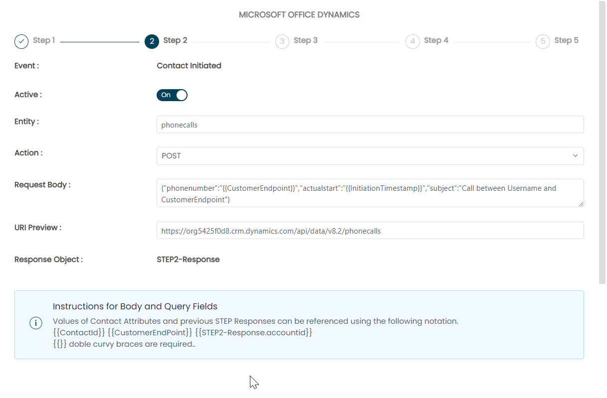

On Step 3, you will provide the details that will be passed to Dynamics
when the call is answered (or made) by the agent. This opens the record
in Dynamics, in the browser, passing the CTR attributes or attributes
from the previous step to the Dynamics API when the record is opened.
You may opt to embed Dynamics within the Engage page in ConnectPath or
open Dynamics in a new tab using the Tab toggle.

The remaining sections in Step 3 reflect that in Step 2, but here you
can see we use the STEP2-Response Response Object to reference a value
received from the previous API request to Dynamics.

In this specific example we are opening the record created in Step 2,
which is based on the phonecalls entity, within ConnectPath. This step
is different as the action is occurring within the ConnectPath user
interface whereas the other actions are occurring within the backend of
ConnectPath to the Dynamics API.

If you are unsure how to format the URI, you may open the corresponding
record within Dynamics and inspect the URL in the Address bar.

The example below can be copied from here:

Query String: { \"appid\": \"{{appid}}\", \"pagetype\":
\"entityrecord\", \"etn\": \"phonecall\", \"id\":
\"{{STEP2-Response.activityid}}\"}

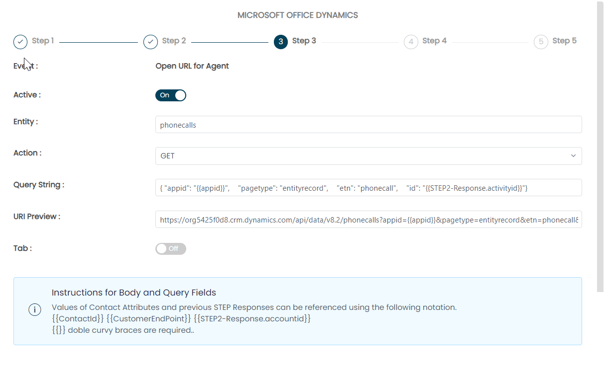

On Step 4, you will provide the details that will be passed to Dynamics
when the call is ended by agent. This appends the record in Dynamics,
passing the CTR attributes or attributes from the previous steps to the
Dynamics API.

The remaining sections in Step 4 reflect that in Step 2 and 3, but here
you can see we use the STEP2-Response Response Object to reference a
value received from the previous API request to Dynamics.

In this specific example we are updating the record created in Step 2,
which is based on the phonecalls entity to add the Connect Channel in
the category field of the record using the PATCH action.

The PATCH action adds an additional field, Query String, which is
appended to the URI of the record when updating the record and must be
wrapped in parenthesis.

The example below can be copied from here:

Request Body: {\"category\": \"{{Channel}}\"}

Query String: (STEP2-Response.activityid)

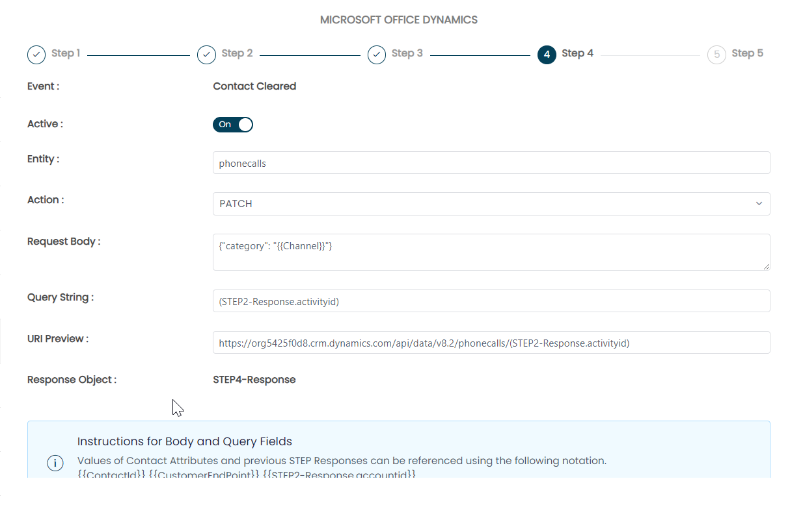

On Step 5, you will provide the details that will be passed to Dynamics
when the recording and/or transcript is available -- this further
appends the record in Dynamics, passing the CTR attributes or attributes
from the previous steps to the Dynamics API. This step utilizes a
CloudFormation template to create an EventBridge rule on the S3 bucket
previously specified that stores the recordings and transcripts. Note
that in some cases the S3 bucket must be configured to send these events
to EventBridge.

In this example, we are providing the path to the call recording under
the description field of the phonecalls entity record.

The example below can be copied from here:

Request Body: {\"description\": \"Your Recording URI is objectUrl\"}

Query String: (STEP2-Response.activityid)

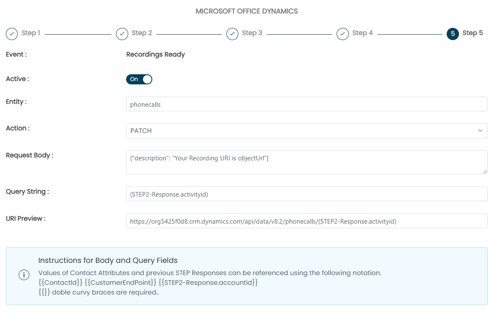

This concludes the configuration of the Integration within ConnectPath.

Usage of the integration by an agent is straightforward in that, based
on the embedded or Popout option, when a contact is received by an agent
or made by an agent, the Dynamics record will be opened within
ConnectPath:

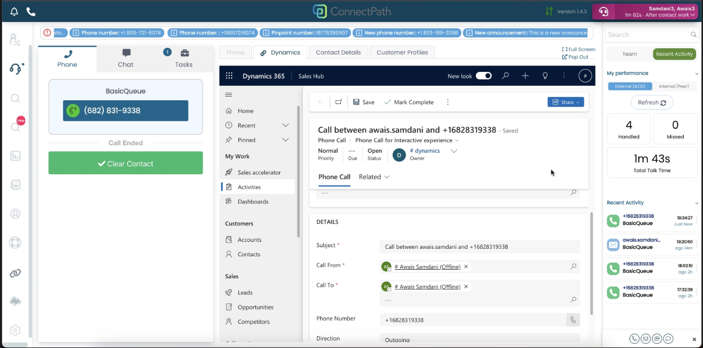

The record can also be viewed later, directly within Dynamics:

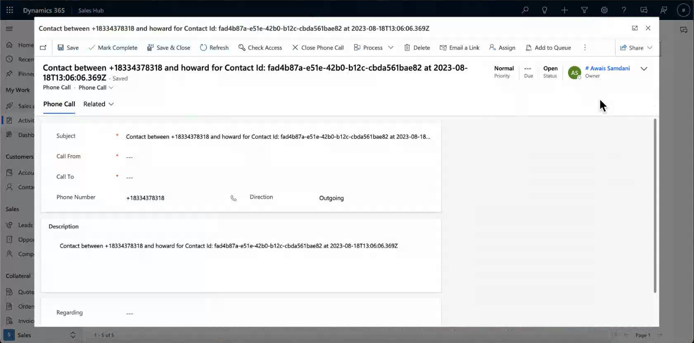

This concludes the setup and use of the Microsoft Dynamics Integration
within ConnectPath.
