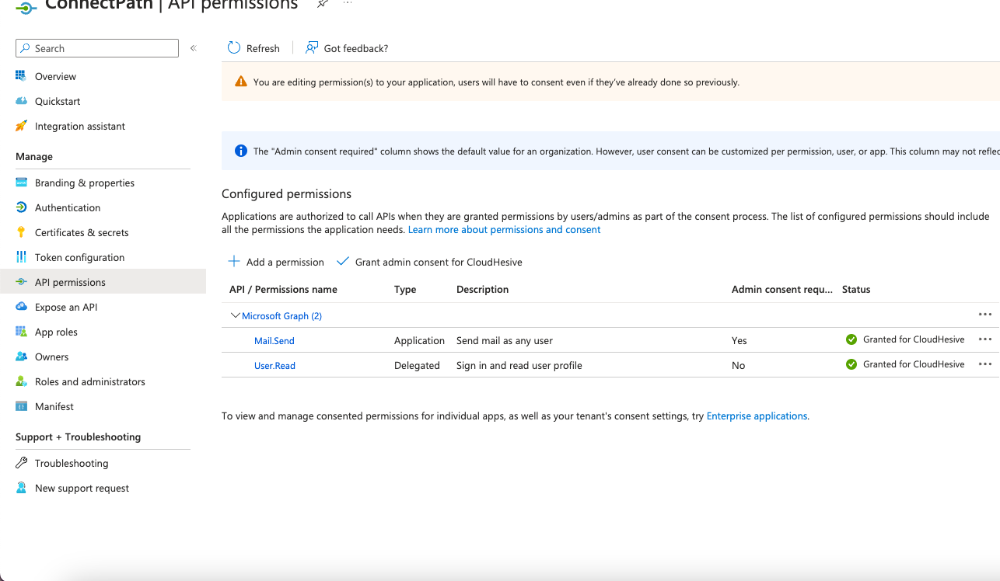

### Configuring outbound E-Mail using Microsoft Office 365 OAUTH

This document will guide you through configuring ConnectPath to be able
to send E-Mail through Microsoft Office 365 using OAUTH (versus Basic)
authentication using an Azure Application Registration.

For inbound E-Mail receiving, which is the first step in configuring an
E-Mail based Webhook in ConnectPath, please review the following
document: https://docs.dextr.cloud/emailTask/

This document is broken up into two sections, the Azure configuration
and the ConnectPath configuration.

As far as Azure configuration goes, the steps will result in you
generating a Client Secret, Client ID and Tenant ID that you will use to
configure ConnectPath. The steps are as follows.

Under Azure Active Directory, go to App registrations and click New
registration.

Enter a name for this App registration and click Register.

On the Overview screen of the App registration, note the Application
(client) ID and Directory (tenant) ID as you will need those when you
setup the ConnectPath portion.

Go to Certificates & secrets and click + New client secret.

Give the client secret a name and set an expiration period (note that
you will need to generate a new client secret ahead of this expiration
period and update ConnectPath to avoid disruption when sending E-Mail
from ConnectPath).

Note the Client Secret VALUE (not ID) as you will use that when you
configure ConnectPath.

Go to API Permissions, click Add a permission, select Microsoft Graph,
select Application, search for Mail.Send and add it to the App. Once
added click Grant admin consent for CloudHesive. Once these two steps
are completed, your API permissions screen should look like the
following.

This completes the Azure portion of the configuration.

As far as ConnectPath configuration goes, the steps are as follows.

Go to Settings, then Integrations, scroll down until you see Office 365
and click Configure.

On this screen you will populate the Client Secret, Client ID and Tenant
ID from the Azure App Registration you previously created.

Go to Settings, then Webhooks, and either click +Webhook or Edit
(Pencil) an existing E-Mail based Webhook:

Once done, click Next (note Step 1 is documented under
<https://docs.dextr.cloud/emailTask/>). On Step 2 you will note there is
an option for Outbound labeled "Basic Auth" or "OAuth", for Microsoft
Office 365 you will use OAuth and select the Integration you created
previously.

Once done, click Next and complete the setup by populating the fields on
the Step 3 screen as documented under
<https://docs.dextr.cloud/emailTask/>).

When you have completed that step, you can click Finish or Update and
your ConnectPath instance is ready to send E-Mail through Microsoft
Office 365.
