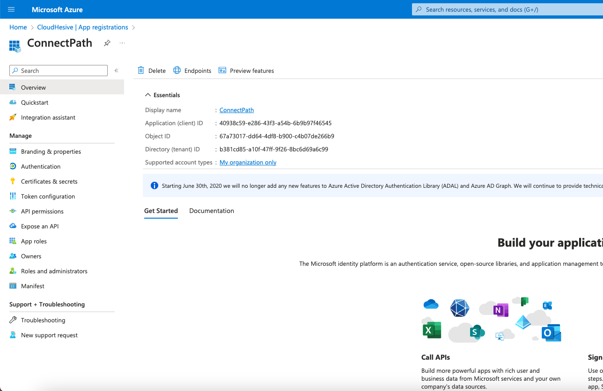
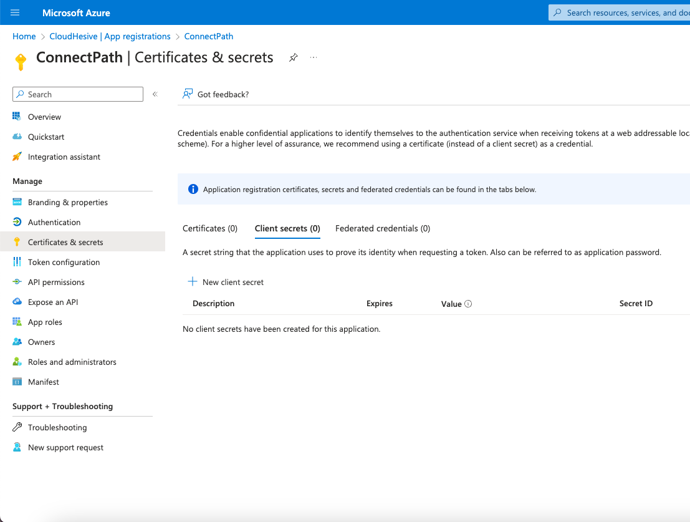
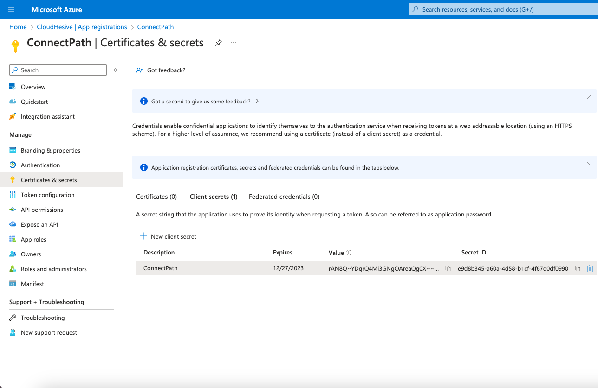
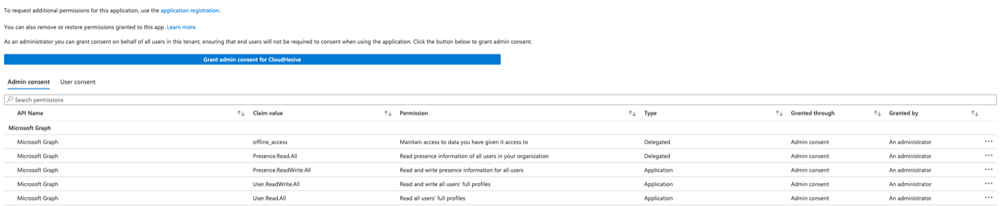
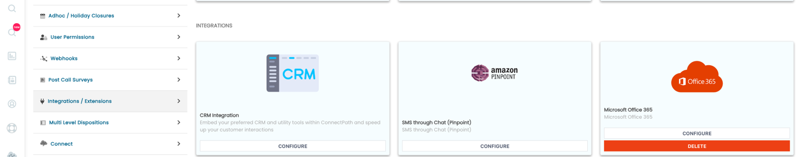
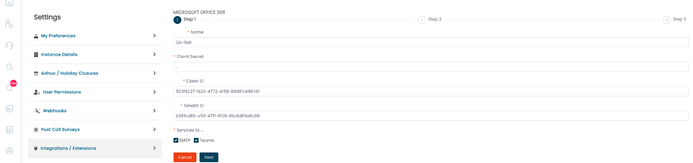
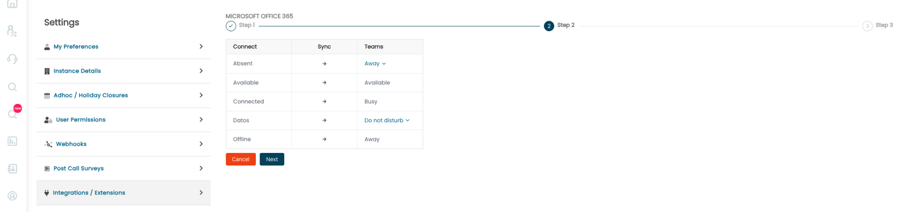
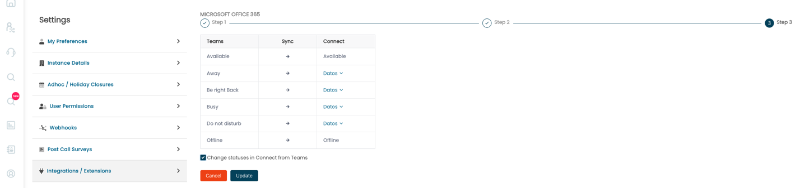
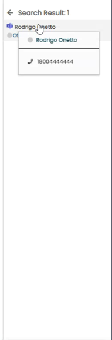

### Configuring the Microsoft Teams Integration in ConnectPath

The Microsoft Teams Integration provides the following capabilities:

1)  Users of ConnectPath can see users of Teams (and their Teams status)
    in the ConnectPath Team Status Drawer.

2)  Teams users who have a directly dialable phone number can be called
    from ConnectPath, following the same rules as an outbound call
    originated from ConnectPath (e.g., recording can be enabled,
    disabled, etc.).

3)  Users of ConnectPath, who are also logged into Teams, will have
    their status in Teams (or their status in ConnectPath updated as
    their status changes in each platform, which is mappable by an
    administrator. For example, a user who is Connected in ConnectPath
    could be made Busy in Teams to avoid unnecessary distractions.

4)  Users of Teams can see ConnectPath users if those users are also
    logged into Teams, and their corresponding status.

5)  Users of Teams may call a ConnectPath user if the Teams user has
    privilege to dial out via the PSTN and the ConnectPath user has
    either a direct dial or direct dial with extension telephone number
    which can follow the same rules as an inbound contact to ConnectPath
    (e.g., recording can be enabled, disabled, etc.).

6)  Synchronization of status can be bidirectional or one-way,
    bidirectional synchronization allows specific rules to be set
    depending on the source of the status change.

This document consists of three parts:

1)  Setup instructions for Teams, which are comprised of creating an
    Application Registration in Azure AD.

2)  Setup instructions for ConnectPath.

3)  Usage instructions for day-to-day operation of the Integration.

A few notes on this Integration:

1)  Microsoft does not currently require additional entitlement to the
    APIs required to integrate to Teams

2)  If a user is in Azure AD but does not have a Teams license, they
    will not be displayed.

3)  Newly created users may take up to an hour to show up in the Team
    Status Drawer

4)  A ConnectPath user may be listed twice in the Team Status drawer if
    they have not yet logged into ConnectPath.

5)  Every hour we force synchronization which will result in us
    resetting the status to the same status (but reset the timer),
    similarly, when placing an agent into Available in ConnectPath, we
    will briefly place the agent Offline first.

6)  When the integration is enabled, we will limit the Team status
    drawer to 300 users but will synchronize status for all users that
    have Teams licenses. This is a temporary measure to reduce potential
    performance issues stemming from use of the Integration.

7)  Short lived statuses (under 15 seconds) will be ignored when it
    comes to synchronization of statuses between the two systems.

8)  We attempt to detect potential status loops when bidirectional
    status synchronization is enabled.

9)  Microsoft Teams has some automatic statuses (like Away, Offline,
    etc.) that should be taken into consideration when configuring
    status synchronization.

10) Given the nature of the Teams APIs, one user, once every 90 days
    will need to log into Teams through ConnectPath to renew the
    authorization for the integration.

Setup Instructions for Teams

As far as Azure configuration goes, the steps will result in you
generating a Client Secret, Client ID, and Tenant ID that you will use
to configure ConnectPath. The steps are as follows.

Note that these steps are similar if you are using Office 365 OAUTH for
E-Mail Webhook SMTP, except for the API Permissions. If your intent is
to use both features, you will create one Application Registration with
both sets of API Permissions applied.

Under Azure Active Directory, go to App registrations and click New
registration.

Enter a name for this App registration, select the Platform Type of Web and enter the following URI:

https://us-east-1.api.dextr.cloud/flex/api/office365/authorization

After that, click Register.

On the Overview screen of the App registration, note the Application
(client) ID and Directory (tenant) ID as you will need those when you
setup the ConnectPath portion.

Go to Certificates & secrets and click + New client secret.

Give the client secret a name and set an expiration period (note that
you will need to generate a new client secret ahead of this expiration
period and update ConnectPath to avoid disruption when sending E-Mail
from ConnectPath).

Note the Client Secret VALUE (not ID) as you will use that when you
configure ConnectPath.

Go to API Permissions, click Add a permission, select Microsoft Graph,
select Application, search for offline_access, Presence.Read.All,
Presence.ReadWrite.All and User.Read.All and add
them to the App. Once added click Grant admin consent for CloudHesive.
Once these two steps are completed, your API permissions screen should
look like the following.

This completes the Azure portion of the configuration.

Setup Instructions for ConnectPath

As far as ConnectPath configuration goes, the steps are as follows:

Go to Settings, then Integrations, scroll down until you see Office 365
and click Configure:

On this screen you will populate the Client Secret, Client ID, and
Tenant ID from the Azure App Registration you previously created.

Note that some of these steps are similar if you are using Office 365
OAUTH for E-Mail Webhook SMTP. If your intent is to use both features,
you will check both SMTP and Teams boxes below:

After clicking next, you will be able to map Connect (ConnectPath)
statuses to Teams statuses:

These include system and custom statuses available in Connect, as well
as top level statuses available in Teams.

Once done you can click next again and perform the inverse action of
mapping Teams statuses to Connect (ConnectPath) statuses:

The checkbox above Cancel or Update in the above screenshot will allow
you to enable or disable status changes in this direction (e.g., from
Teams to Connect or ConnectPath).

Once done you can click Save or Update if updating an existing
configuration.

This concludes the setup of ConnectPath for the Teams Integration.

Usage Instructions

As indicated above, once per day a user will need to re-authorize
ConnectPath to use the Application Registration and when this is
required, users will see the following in the Team Status Drawer:

Upon clicking Teams Login, the user's web browser will open and prompt
the user to authorize the application.

Teams users in the Team Status Drawer will be presented with a Teams
Icon like such:

Right clicking on a Teams user will present the opportunity to display
the Teams user's phone number and call said number like such:

This concludes the instructions to setup the Microsoft Teams Integration
from the perspective of Microsoft Office 365 (Azure AD) and ConnectPath
as well as the high-level usage of the feature from a day-to-day
perspective.
