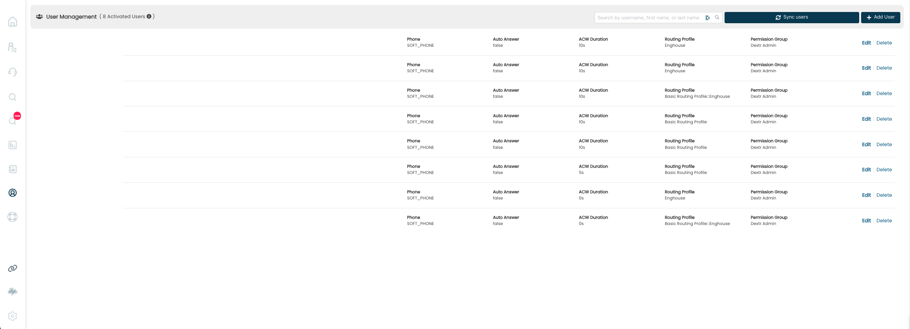
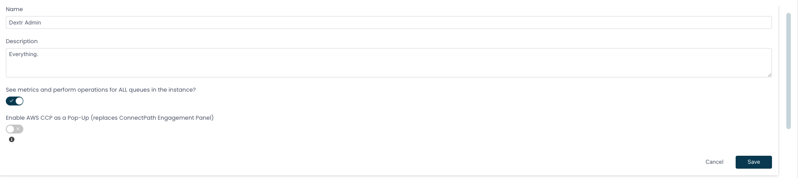
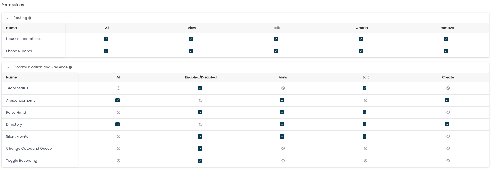
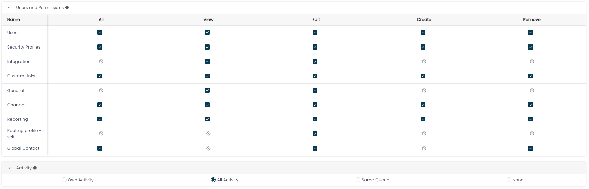
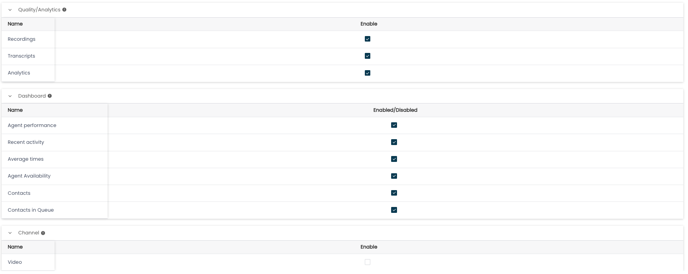

### Permission Groups

ConnectPath utilizes Permission Groups to determine what a user, once
logged into ConnectPath, can do and/or see. This is similar to Security
Groups in Amazon Connect (which ConnectPath also uses to determine which
native Amazon Connect features may be displayed/interacted with).

The users screen looks like the following and can be accessed off of the
main menu:

Users that are created in Connect but not ConnectPath (e.g. users that
have not logged into ConnectPath and ConnectPath instances in which the
users were not synchronized using the synchronize button) will default
to a defined Permission Group. On new instances this is the admin
permission group (one of two default permission groups: admin and
agent), to facilitate initial setup of the ConnectPath instance:

./Permission-Groups/media/image2.png)

In the above screenshot you can see the two default groups as well as a
custom group. The Admin group is the default that all new users get, in
this case.

It is recommended the default permission group be changed to the most
restrictive permission group once a set of admin users have been defined
(in terms of default permission groups, this would be the agent
permission group).

A few notes about Permission Groups

Access to the API feature is limited to "Instance Admins" currently.

"Instance Admin" gets all permissions, regardless of what the default
permission group or admin permission group is configured for. This is
intended to be used in "break glass" scenarios where change of
permissions for an admin/privileged permission group inadvertently
removes access to manage permissions.

Specific permission definitions within each Permissions Group may be
found below:

Name -- Name of the group

Description -- Description of the group

See metrics and perform operations for ALL queues in the instance

On -- Shows the user metrics for all queues on the home screen

Off -- Uses the user's routing profile to determine which queues the
user should see metrics for on the home screen

Enable AWS CCP as a Pop-Up

On -- Engage tab has no softphone controls and instead the Amazon
Connect CCP is opened in a new window

Off -- Default ConnectPath behavior

Permissions

All -- Item may be viewed, edited, created and removed

View (or Enabled/Disabled) -- Item may be viewed

Edit -- Item may be edited

Create -- Item may be created

Remove -- Item may be removed

Routing

Hours of Operations -- Settings \> Adhoc / Holiday Closures

Phone Number -- Deprecated

Communication and Presence

Team Status -- Interact with Team Status Drawer

Announcements -- Interact with Announcements feature

Raise Hand -- Interact with Raise Hand Feature

Directory -- Interact with Directory/Directory Contacts

Silent Monitor -- Interact with Silent Monitor Feature

Change Outbound Queue -- Allows selection of queue to use when making an
outbound call

Toggle Recording -- Controls state of recording while in an active call

Users and Permissions

Users -- Manage Users

Security Profiles -- Manage Permission Groups

Integration -- Manage Integrations

Custom Links -- Manage Custom Links

General -- Manage General Settings

Channel -- Manage Channels

Reporting -- Manage Reporting

Routing profile -- self -- Self-service Routing Profile Management

Global Contact -- Manage Global Contacts

Activity

Own Activity -- Provides access to see own activity in Activity Search

All Activity -- Provides access to see all activity in Activity Search

Same Queues -- Provides access to see activity of the same queues as the
user, based on the user's routing profile

None -- Provides no access to Activity Search

Quality/Analytics

Recordings -- Provides access to Recordings in Activity Detail

Transcripts -- Provides access to Transcripts in Activity Detail

Analytics -- Provides access to Analytics in Activity Detail

Dashboard

Agent Performance -- Provides access to agent performance widget on home
screen/dashboard screen

Recent activity -- Provides access to recent activity widget on home
screen/dashboard screen

Average times -- Provides access to average times widget on home
screen/dashboard screen

Agent availability -- Provides access to agent availability widget on
home screen/dashboard screen

Contacts -- Provides access to contacts widget on home screen/dashboard
screen

Channel

Video -- Provides access to user to create a meeting (video call) on
Engage screen
