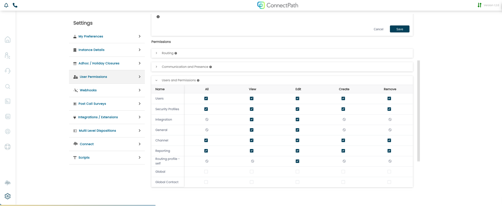
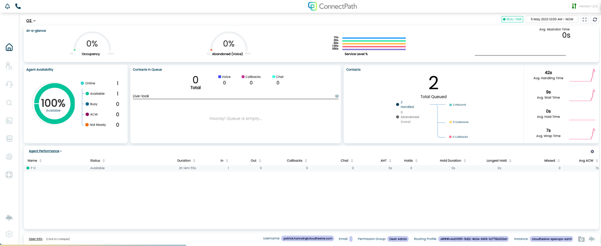
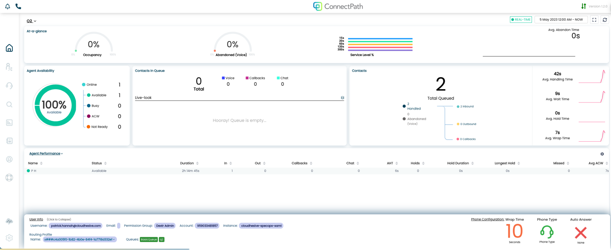
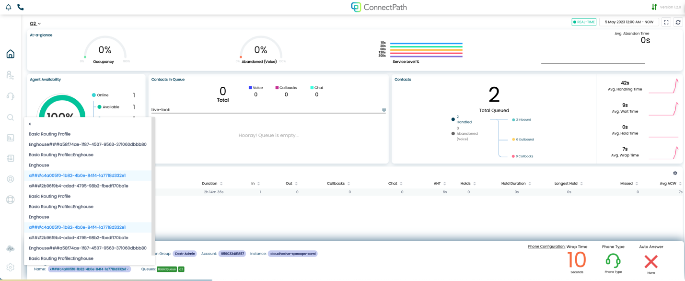

ConnectPath supports the ability for a user to change his or her routing
Profile without intervention from a privileged user. This capability is
most often used by Contact Centers in which throughout a shift or work
week, individual agent's responsibilities change, for example on
Monday's an agent may handle Sales contacts and on Tuesdays an agent may
handle Support contacts. With this capability the agent can make that
determination and selection without engaging with a privileged user.
This capability has its own permission, so that customers can determine
which agents may make this change to themselves and which agents may
not.

To get started, you will need to go to Settings and create either a new
set of User Permissions or edit an existing set of user permissions. The
permission users will need to take advantage of this feature is "Routing
profile -- self":

Once a user has been enabled with that feature, the user may see his or
her current Routing Profile and Queue membership, or change his or her
Routing Profile (and subsequently Queue membership) by clicking on the
User Info link at the bottom of the Home screen:

Upon clicking User Info, the modal will expand and the Routing Profile
can be changed by clicking on it:

Upon clicking on it a selection of Routing Profiles will be displayed,
and the user can select the appropriate one:

Once selected the selection will be updated in Amazon Connect and the
agent will begin receiving contacts for Queues associated with that
Routing Profile.
