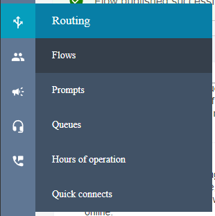
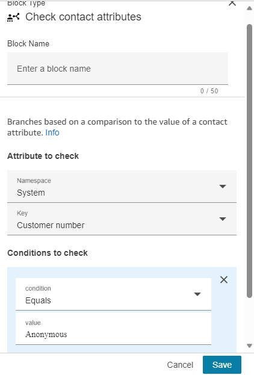
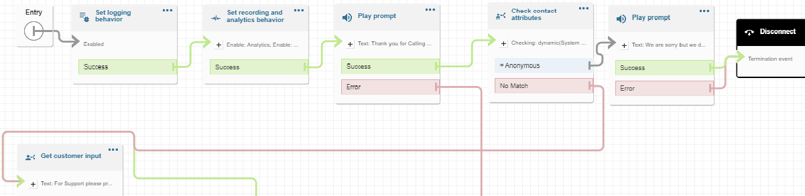

### Setting up a block on Anonymous callers

You can Leverage a "Check Contact Attributes" block in your call flow to
check the Caller ID of the caller, and if the caller's number is
"Anonymous" you can then decide how you want to treat that call
differently than the rest of you callers. Here are the steps you will
need to follow:

1)  Log into your Amazon Connect environment, or if you are Logged into
    Connect Path with an administrative account, you can click on the
     icon in the lower right of the home
    screen, and that will open your Amazon Connect Interface in a new
    tab.

2)  In the Amazon connect interface Navigate to the Call Flows
    interface.

3)  Locate the call flow where you would like to add the check to
    determine the call is being sourced from an Anonymous Caller and
    open that call Flow.

4)  Once in the Flow, identify the stage in the call flow where you
    would like to add the check to determine if the caller is an
    anonymous caller (in my example, I opted to place the check
    immediately after I play my initial prompt to the caller).

5)  In the blocks panel on the left-hand side of your call flow, open
    the section called "CHECK" and Drag and Drop the "Check Contact
    Attributes" into your call flow in the general area where you would
    like to add the check.

6)  Go into the setting for the "Check Attributes block" and put in the
    following settings.

    a.  Set Namespace = System

    b.  Set Key = Customer number

    c.  Under "condition to check section", click on "add another
        condition".

    d.  Set Condition = Equals

    e.  Set Value = Anonymous

    f.  Your Block should look like this:

> 

7)  Click the Save Button

8)  Depending on where place this in your flow, you will need to connect
    the "Success" Step of your previous block to the newly added "Check
    Contact Attributes" block.

9)  In my example, I chose to play a prompt to the Anonymous caller, so
    I dropped in a Play Prompt block from the Interact section of the
    call Blocks Panel on the left side of the screen. To keep my Flow a
    bit clean I also pulled in a Disconnect Block from the Terminate
    section.

    a.  My message was a simple text to speech noting that "Sorry, we do
        not accept calls from Anonymous numbers".

10) You will need to connect your "Check Contact Attributes" out put to
    the rest of the flow

    a.  You will need to connect the "= Anonymous" output to the next
        step you want to take with it. In my example, I connected this
        to my Play Prompt in step 9, but you could also just connect it
        to a disconnect block.

    b.  The "No Match" output needs to be connected to the next block of
        your normal call flow.

11) Click on "Save" in the upper right corner and then click on
    "Publish".

This is what my flow looks like once I added the my Anonymous caller
check:

You have now successfully added a process to prevent Anonymous from
getting to your users.
