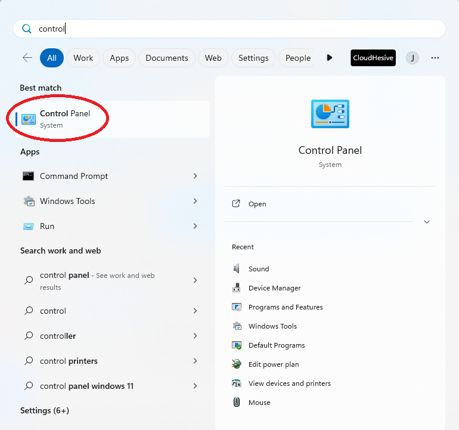
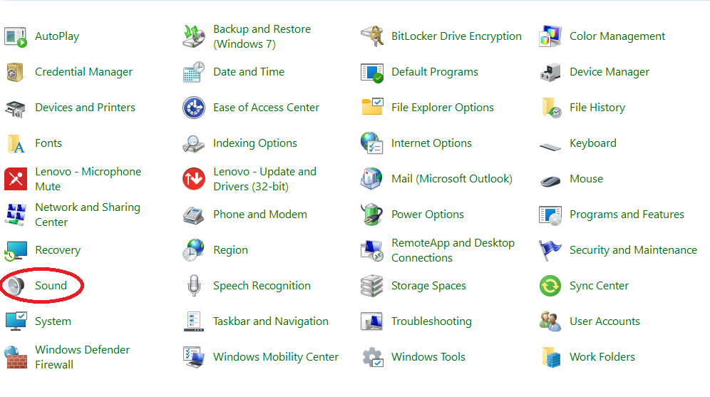
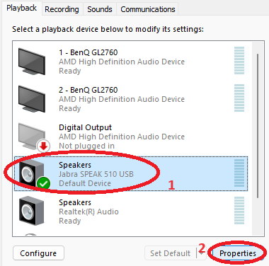
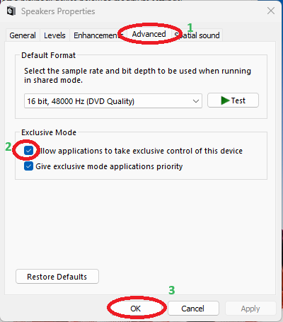

### Turning Off Exclusive Control of Audio Devices

When using ConnectPath and other tools that allow you to make and take
calls (like MS Teams for example) it is possible that when attempting to
take a call in ConnectPath, you will be in a position where even though
you are clicking the button to take a call, you are not able to answer
the call, and then will be tagged with a Missed Call. This can be caused
by a sound setting that allows applications to take exclusive control of
your audio devices. To turn off this setting, you can use the steps
below.

1.  Click on the Windows Start Button and start typing in 'Control
    Panel', as soon as you see the control panel application click on
    it.

2.  Once in the Control Panel click on the Sound Icon

3.  On the 'Playback' tab find your headset, select it, and then click
    on Properties.

4.  Once in the Properties Section go to the Advanced Tab and under the
    Exclusive Mode section, uncheck 'Allow Application to take exclusive
    control of this device' option and then click on 'Ok'.

5.  This will return you back to the 'Sound' Interface.

6.  Now Click on the Recording Tab, and repeat the steps above to turn
    off exclusive mode for your microphone device.

7.  Once you complete this for the Microphone, click 'OK' in the 'Sound'
    window to close it, and you have now turned off Exclusive Mode for
    your headset.
