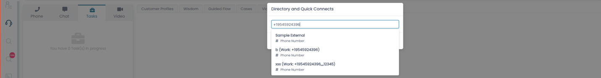

### Video Channels

ConnectPath supports Video Calling via the Amazon Chime SDK by setting
up the requisite infrastructure within the same AWS Account as your
Amazon Connect Instance. Chime Video Calling may be used either
concurrently with Amazon Connect Voice or independently, based on the
requirements and workflow of your organization.

Setup is a two-part process that involves deploying the requisite
infrastructure (which can be performed entirely within ConnectPath) and
granting permissions to use the feature to one or more permission
groups.

As this feature uses additional AWS Services, it will incur costs,
billed by AWS to your AWS Account.

To get started, go to Settings, Integrations and under the Amazon
Chime Logo, Click Deploy:

Click Deploy again to confirm that you wish to deploy:

You will see the status has changed to Deploying:

Once done Deploying, you will see that the status has changed to
Deployed:

Deployment of the requisite infrastructure is performed via
CloudFormation, and the resulting infrastructure is a CloudFront
distribution, S3 Bucket and simple serverless application that is
intended to host the customer-facing side of the solution, including
joining the already-in-progress meeting. The customer-facing assets are
designed to be rebranded and may be done so either independently or with
the support of CloudHesive.

After this step, for each group of users that you wish to give access to
the feature, you will need to add the permission to their permission
group. The permission is named Video can be found in the Channel
section:

Once setup, agents will see a new Tab under the Engage page, Video. By
going to this tab, the agent may start a Video Call or return to a
previously started Video Call.

Starting the Video Call is as simple as clicking the Create Meeting
button:

Once created, the meeting will start immediately for the agent,
connecting his/her audio and video. The agent video will be displayed on
the top right-hand corner with most of the screen being reserved for the
customer.

Basic meeting controls are found on the left-hand side that allow for
control of audio, video, screen sharing, and audio/video devices as well
as a button to end the meeting (in red).

The meeting details can be copied and sent via E-Mail or SMS, if
configured, within ConnectPath. Click the copy icon next to the Meeting
Info before proceeding to the next step.

In this example, we will send the meeting details via SMS, using
ConnectPath, by going to the Tasks tab and clicking the SMS button:

After clicking the SMS button, you will be prompted to provide the phone
number of the person you wish to SMS.

This will initiate an SMS conversation, and once you click on the
conversation, you may paste the previously copied meeting details and
send them to the customer:

From the customer perspective (in this example an Apple iPhone), he or
she may click the link to join the meeting and it will be opened in
their default web browser (in this example Safari):

The customer may then click the Join Meeting button and at that point he
or she will be prompted to share their Microphone and Camera with the
Application:

Once the customer joins the meeting, he or she will see the agent's
video but not his or her own video:

By scrolling down, the audio and video settings can be changed, or the
meeting can be ended:

This concludes the setup and use of Video Calling in ConnectPath.
