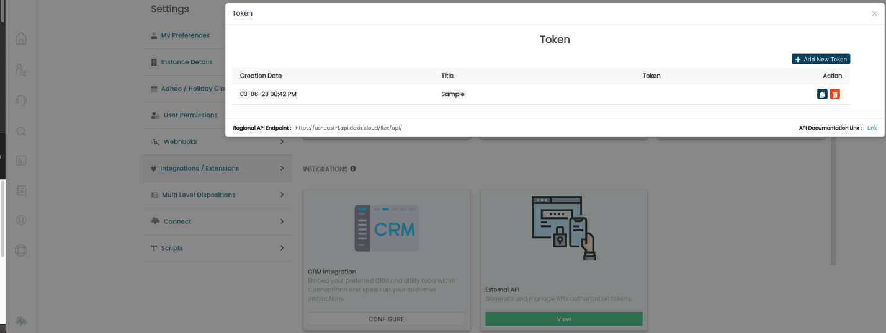

ConnectPath exposes several authenticated and authorized APIs to provide
flexibility to our customer's needs and extend the capabilities of
ConnectPath.

Each API Family represents a screen within ConnectPath, and for each
Family, Swagger Documentation and a Postman Collection can be found
below.

Authentication consists of a bearer token in the requests, the token can
be generated as follows:

First, you'll need to log into ConnectPath as the Instance Admin, this
is the same as the "Emergency Access" login from the AWS Console.

From there, you will go to Settings, then Integrations. At this point
you'll notice an External API button below:

Click on View and then Click on Add New Token:

Give the token a name and then click Save.

You'll now see the token's creation timestamp, name and the token itself
below:

You may copy the token with the copy button or delete it with the trash
can button.

You'll also notice the Regional API Endpoint -- this is the region your
ConnectPath deployment operates in and if you are using the examples
below and in a region that is not us-east-1, you'll need to update the
endpoint in those examples accordingly.

The API Family Swagger Documentation and Postman Collections follow.

For convenience we also have a hosted copy of the Swagger Editor [HERE](./api/swagger/index.html)

Users

Swagger Documentation [HERE](./api/user-api/user-api.json)

Postman Collection [HERE](./api/Users.postman_collection.json)

Directory

Swagger Documentation [HERE](./api/directory-api/directory-api.json)

Postman Collection [HERE](./api/ContactsDirectory.postman_collection.json)
