ConnectPath allows privileged users to update the Disposition of a
completed contact, overriding a Disposition previously selected by an
agent and effectively forming a Call Blocking Workflow by integrating with
ConnectPath's Database in a Contact Flow via a Lambda Function.

Combined with a DynamoDB index, Lambda function and Contact flow, you
can create a workflow within ConnectPath and your contact flow to block
callers who may be nuisance or malicious in nature.

This can be setup either as a 1-step or 2-step process. The 1-step
process allows the agent to specify a Disposition value that is
referenced in a Contact Flow for use when the individual calls back from
the same number. This process looks like the following:

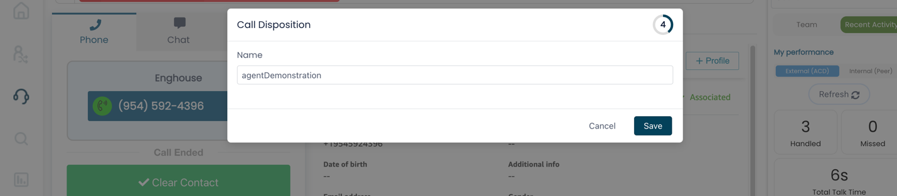

The 2-step process allows the agent to specify a Disposition value that
can be used by a privileged user, who can then evaluate the criteria of
the Disposition via notes and determine if blocking is warranted. If it
is, then the privileged user can then update the contact with another
Disposition value that is referenced in a Contact Flow for use if that
individual calls back from the same number. This process looks like the
following:

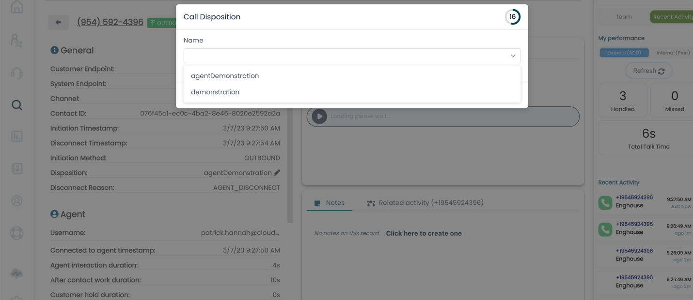

On the backend, to set this up, you will need to perform the following
actions from within the AWS Console in the same AWS region as your
Amazon Connect Instance. In the case of these screenshots, the sample
instance is in N. Virginia or us-east-1, which can be seen in the top
right-hand corner of most screenshots. If your Amazon Connect instance
is not in the us-east-1 region, you can use the drop down to select the
correct region.

Identify your ConnectPath Instance's DynamoDB Table

In the AWS Console, under DynamoDB, go to Tables and enter the prefix
dextr-, you should see a table that begins with dextr- and ends with the
name of your ConnectPath Instance:

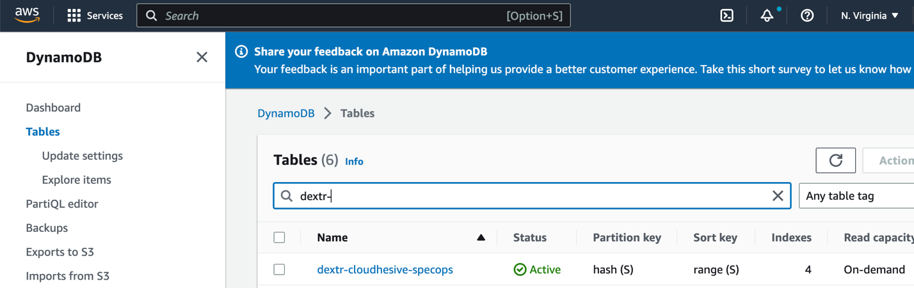

Create the DynamoDB Index

Once you have identified the correct DynamoDB table, click on the name
of it, then Indexes, then Create index:

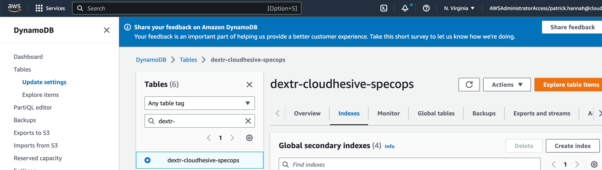

Create a new index with the Partition key of Disposition, Sort Key of
CustomEndpoint, and Attribute Projections of only Keys. All other
options should remain as default.

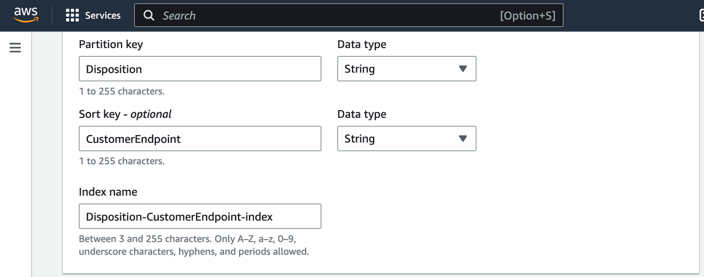

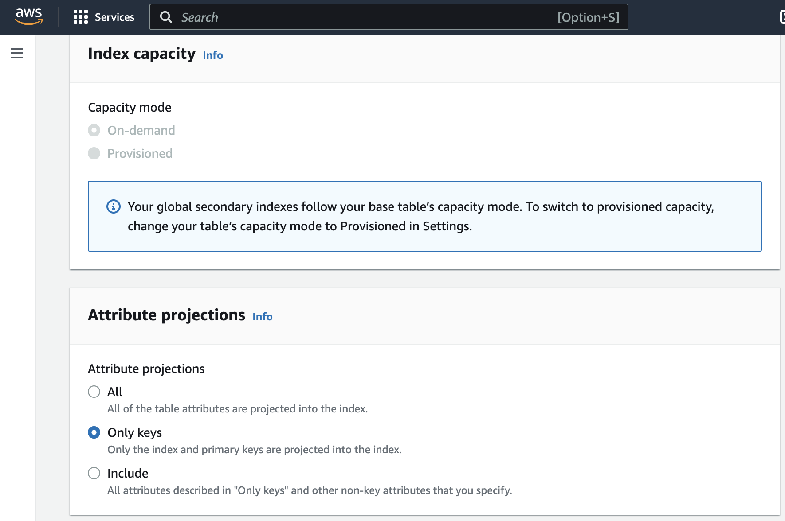

Create Lambda Function

With the Index created on the DynamoDB Table you can now proceed to
create the Lambda Function that will be invoked by the Contact Flow and,
in turn, use the newly created DynamoDB index to retrieve the
CustomerEndpoint (phone number) for the Disposition specified in the
Contact Flow (described in a later section).

In the AWS Console, under Lambda, go to Applications, Create
application:

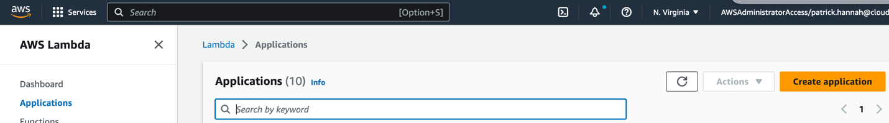

Click from scratch:

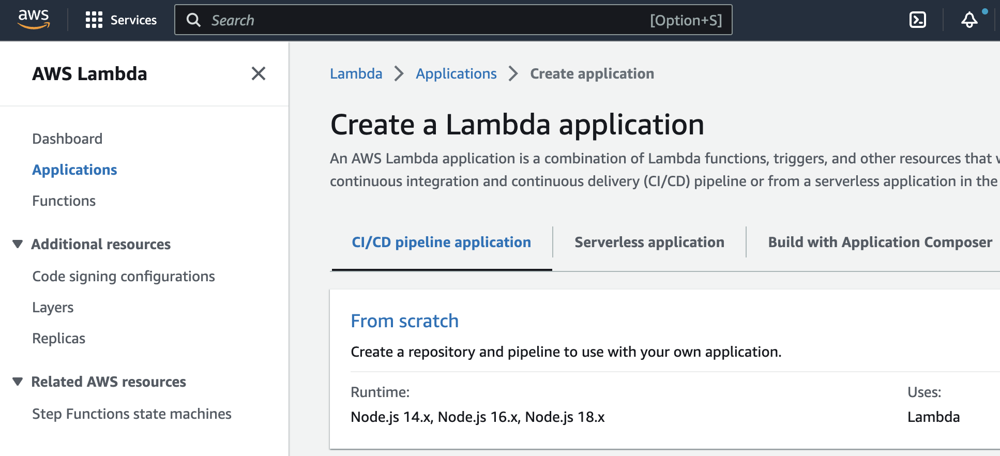

Name the function (blockedCalls is the name used in the example below),
and specify that you wish to create a new role from AWS policy
templates, name the policy the same name as the function (blockedCalls)
and select Simple microservices permissions as the Policy template:

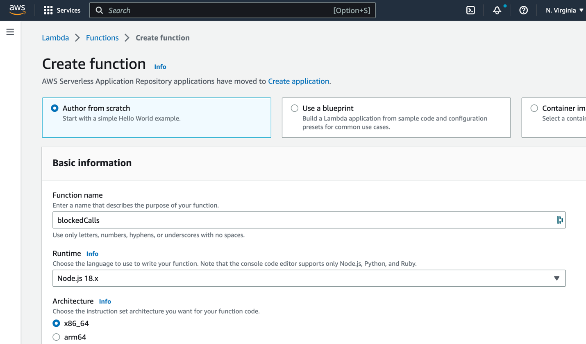

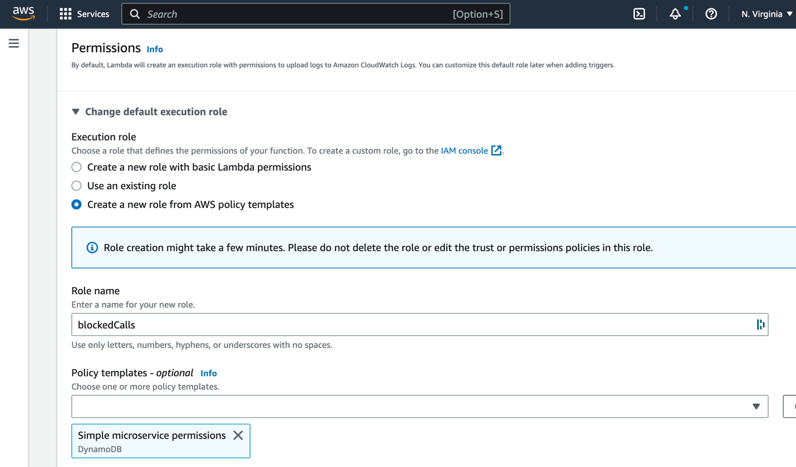

Once the Lambdas function is created click Upload from, click Upload,
select the zip file downloaded from [HERE](./caller-blocking/blockedCalls.zip) and click Save:

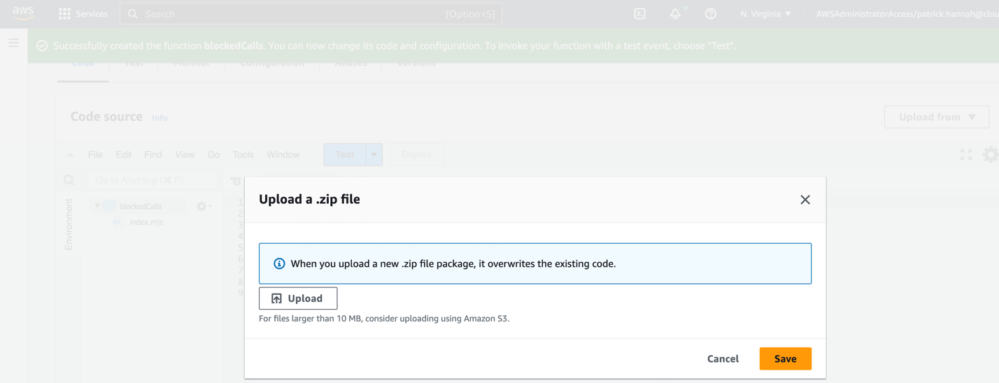

This completes the creation of the Lambda function.

Import Contact Flow Module

Starting with this step, the remainder of the activities will be
performed within the Amazon Connect console.

Before you can integrate the feature into your Contact Flows, you will
need to import a Contact Flow Module, which you can do by going to
Contact Flows, Modules and then clicking Create contact flow module:

Select from the far right drop down Import (beta), and import the
Contact Flow Module downloaded from [HERE](./caller-blocking/blockedStatus)

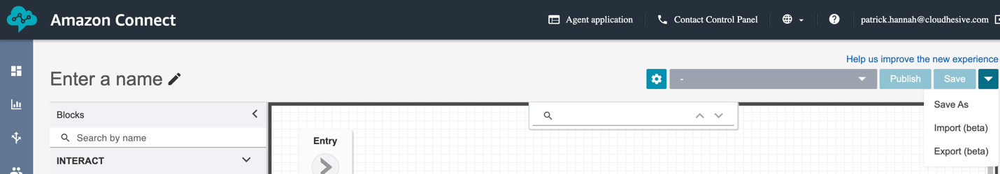

Once imported, note the name (blockedStatus in this example), set the
BlockedDisposition value to the one that you wish to use for phone
numbers that should be blocked (demonstration in this example), and set
the InstanceName to the name of your instance:

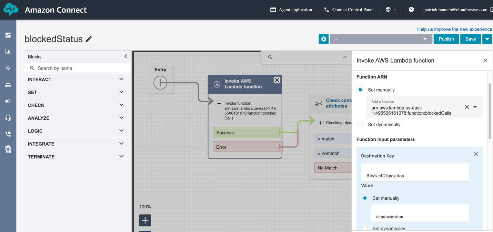

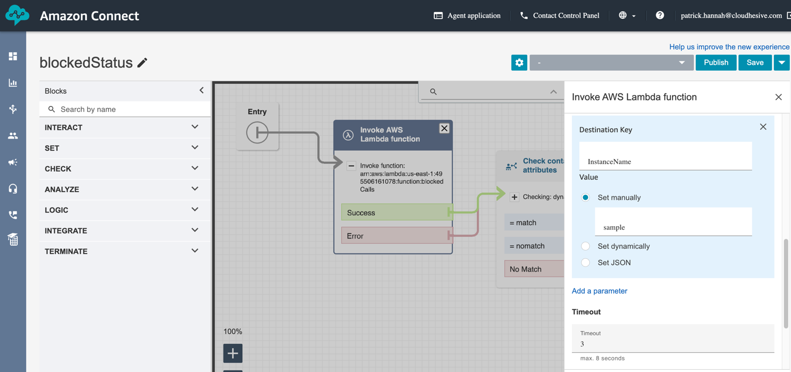

Once done click Save and Publish.

You may now reference this Contact Flow Module in an existing Contact
Flow by using a Check contact attributes block to read the value of the
blockedStatus value as match (phone number is on blocked list) or
nomatch (phone number is not on block list).

This concludes the initial setup of the Call Blocking Workflow as well
as a basic walkthrough of updating a Disposition as a privileged user
using Activity Search.
