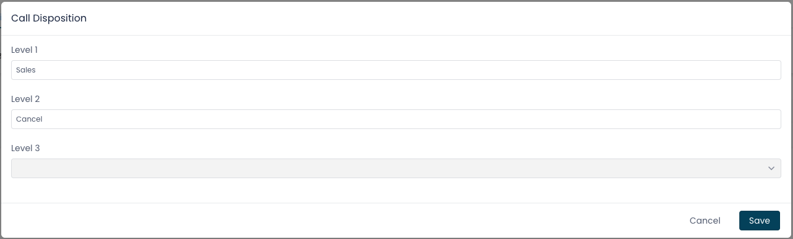
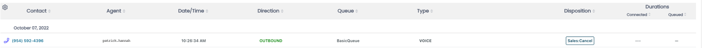
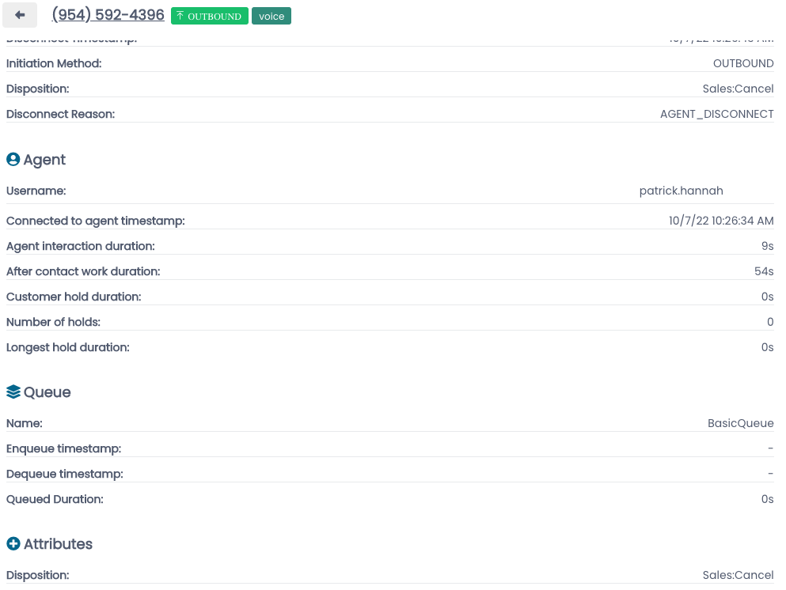
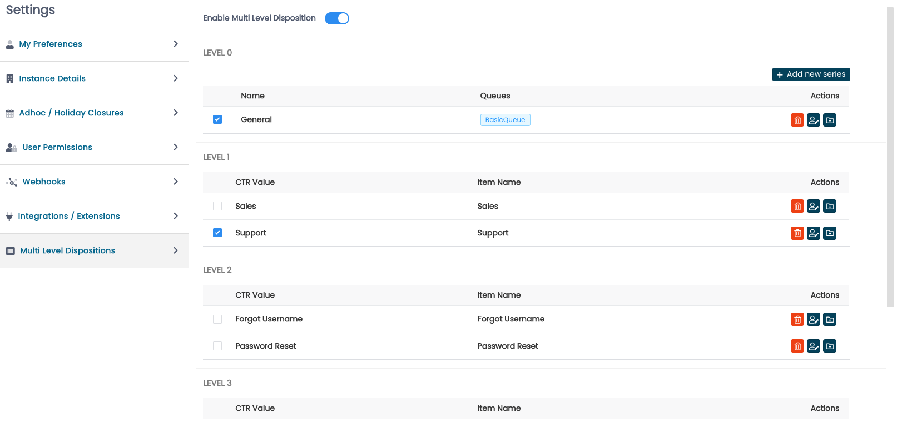
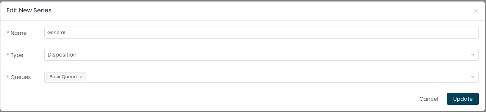
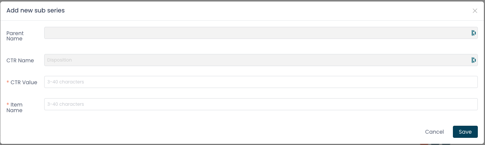
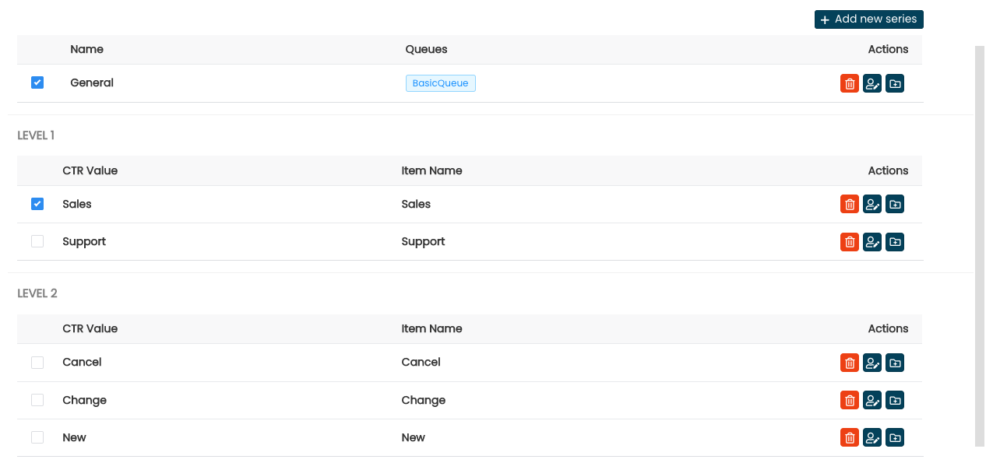

# Introducing Multi Level Dispositions

Dispositions, while implementation specific details may vary, and
customer use cases may vary, provide the ability to gain additional
insight into contacts between your organization and your organization's
customers.

Until recently, ConectPath has offered a single tier Disposition solution --
e.g. the agent, based on the queue is presented with a single drop down
to select one option from.

With Multi Level Dispositions, your agents can be given the ability to
further drill down into the Disposition, in a tree like fashion,
providing greater clarity than provided by a single tier disposition
model.

Once configured, upon the end of a contact, much like with single tier
dispositions, the agent is presented a model with a variety of
preconfigured selections.

As the agent selects an option at each tier, the list of options at the
next tier is populated, allowing for further refinement, as depicted
below:

Reporting, much like the single tier predecessor, will display both the
Disposition in it's own field as well as write it to the Attributes in
the CTR, which can be used with external analytics solutions:

Multi level dispositions do not coexist with single tier dispositions,
and upon enabling multi level dispositions, the single tier disposition
feature will be disabled. Incidentally, upon disabling multi level
dispositions, the single tier disposition feature is reenabled, which
provides an easy migration path in the event you opt to roll back the
capability.

Once you enable dispositions, you are presented with a blank slate and
start by clicking "Add new series". The Series is where you would select
the queue or queues to be used in the invocation of the multi level
disposition prompt to the agent. You can also give it a name to refer
back to. In our example we are going to create a general series, that
may be used for catch all queues that may support both sales and support
contacts:

From here, you would add a sub series, starting at level 1, these would
be the first tier of values that may be selected by an agent. You would
specify the name (to be displayed to the agent) and the value to be
written to the CTR:

Once you have populated Level 1, you will notice each row has a checkbox
beside it, checking this box will allow you to create or edit options at
Levels 2 and Levels 3. Continuing with the theme above, Level 1 will be
used to specify whether this was a Sales or Support call and Level 2, as
displayed below, will provide options of Cancel, Change or New to agents
who select the Sales option at Level 1:

Once you are satisfied with the new disposition structure, you can
enable it using the "Enable Multi Level Dispositions" toggle located at
the top of the series page.
