This document will walk you through the initial setup of Twilio and
ConnectPath to support the receipt of SMS and MMS messages from Twilio
into ConnectPath as well as the origination of SMS and MMS messages from
ConnectPath to Twilio.

It's broken up into four sections so that users of ConnectPath who have
already setup Twilio or setup ConnectPath to receive messages from
Twilio but wish to send messages from ConnectPath to Twilio may jump
straight to those sections.

SMS/MMS messages received from Twilio to ConnectPath, for new
conversations, will utilize the Contact Flow specified under the Twilio
Webhook configuration in ConnectPath. Once a conversation has been
established, it will be pinned to that agent, via one or more tasks,
until the agent ends the conversation, in which case subsequent messages
from the same SMS/MMS number will result in a new conversation.

For SMS/MMS messages originated from ConnectPath to Twilio, the agent
may initiate the message under the Engage tab by selecting Tasks and
clicking on the SMS icon at the bottom of the screen. This will prompt
the agent for a phone number and upon clicking continue, a Task will be
created in Amazon Connect, routed to that agent and auto-accepted in
ConnectPath. At that point the agent may start composing his/her
message. This creates a new conversation, which follows the same rules
as SMS/MMS messages received from Twilio, e.g. it is pinned to the agent
until the agent ends the conversation:

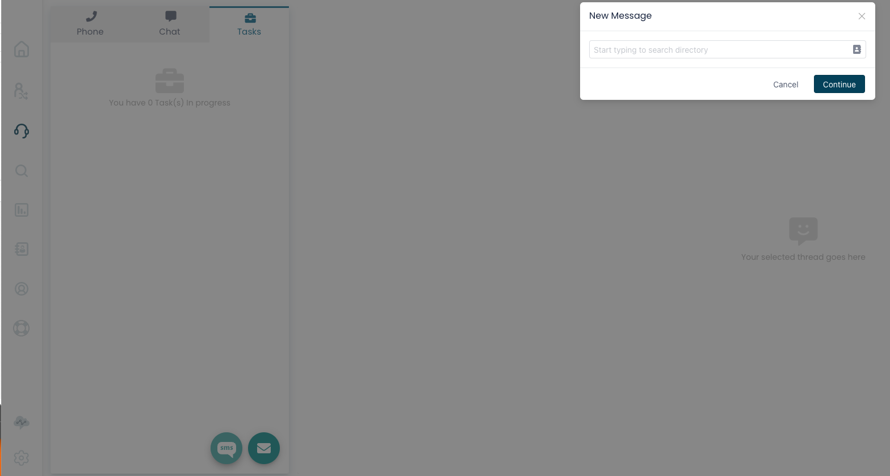

Setup Twilio Webhook in ConnectPath

This step will generate the Webhook URL required in the Setup Twilio
Step and provide ConnectPath the Twilio credentials required to respond
to a conversation or create a new conversation with the Twilio APIs.

In ConnectPath, Under Settings, Webhooks, click +Webhook to begin
creating your Twilio Webhook.

On the first screen, give it a name and description, and set the type to
SMS and Provider to Twilio:

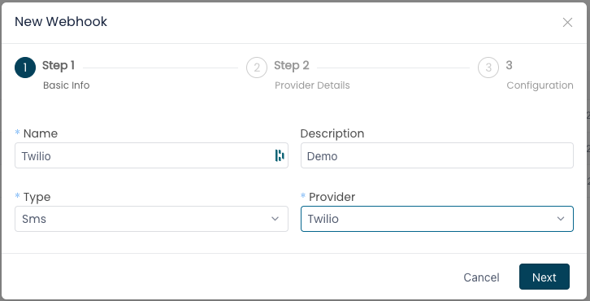

Click Next and enter the Account SID, API Key (both values are the same)
and API Secret, which can be found on the Twilio Project's dashboard:

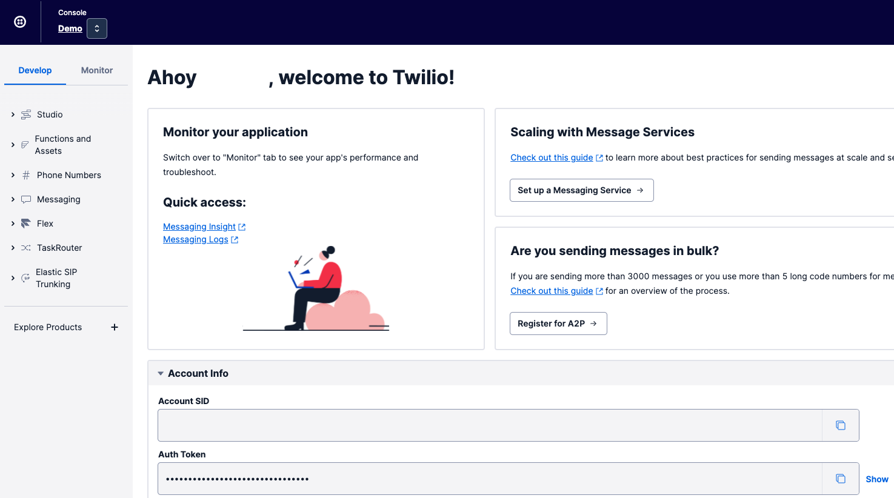

Click Next:

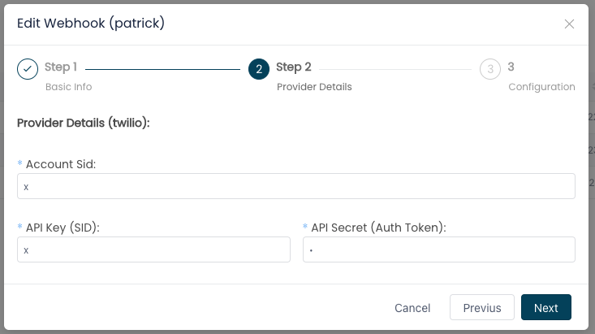

Finally, select a Contact Flow, Sample inbound flow (first contact
experience), is an out of the box Contact Flow designed to work with
Tasks, and can be used or modeled to customize your own Contact Flow,
enter the default SMS/MMS phone number to use when originating SMS/MMS
messages from ConnectPath (e.164 format without the leading +), and then
messages for Initial and Final Responses:

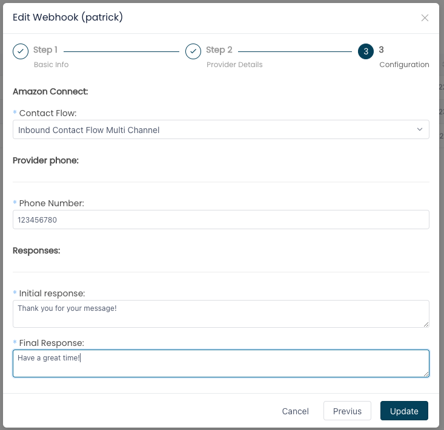

Once done, click Update.

This completes the creation of the Twilio Webhook in ConnectPath.

Setup Twilio

For conciseness, the steps in signing up for Twilio, creating a Project
in Twilio, adding a payment method to that Twilio Project, validation of
your contact details and other prerequisite steps required to acquire a
10-digit number (regulatory) or non 10-digit number are not covered
here.

On your Twilio Project's dashboard, note the Account SID and Auth Token
-- you'll need to provide this information when you setup the Twilio
Webhook in ConnectPath:

Under Phone Numbers, then Buy a number, find a number that suits your
needs (Country, criteria, etc.) that supports SMS and MMS:

Under Messaging, then Services, click Create Messaging Service. Upon
doing so, you will be presented with the following screen:

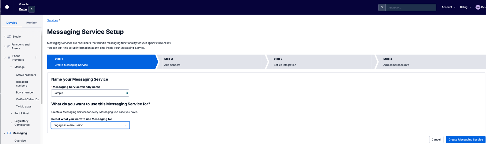

Name your messaging service and then select "Engage in a discussion" as
the Messaging Service use case. After that, click Create Messaging
Service, then Add Senders, and you will be presented with the following
screen:

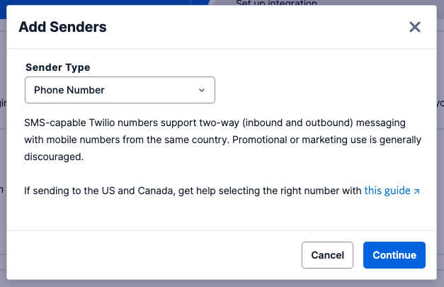

Select Phone Number, then Continue, and you will be presented with the
following screen:

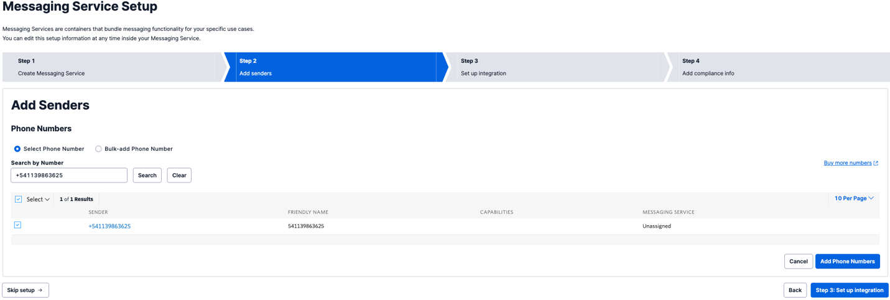

Select the phone number you acquired in a prior step, click Add Phone
Numbers, then click Set up integration:

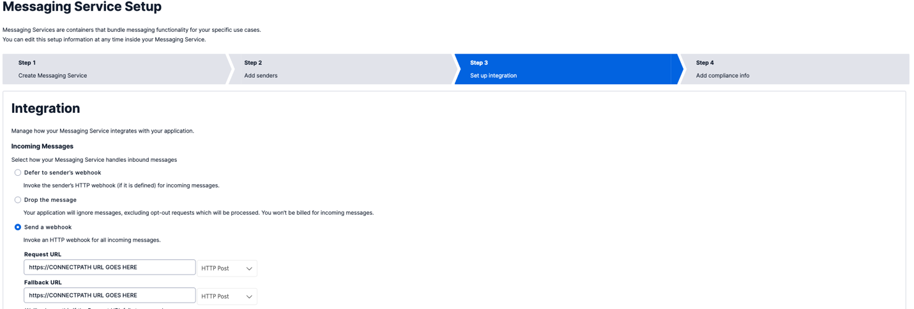

Select the radio button "Send a webhook" and enter the URL provided in
the ConnectPath Twilio Webhook Screen (more details are under the "Setup
Twilio Webhook in ConnectPath"

step) in the Request URL and Fallback URL fields. Once done click Add
Compliance Info and you will be presented with the following screen:

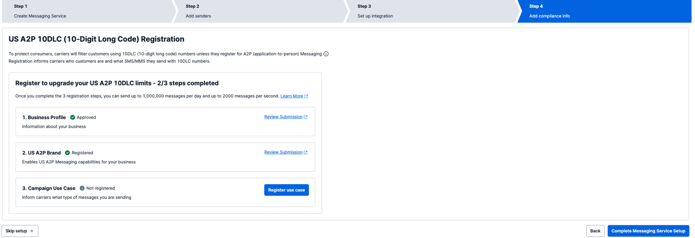

Finally, click Complete Messaging Service Setup.

At this point you have completed the steps required to provision an
SMS/MMS phone number in Twilio and integrate it with ConnectPath via the
Twilio Messaging Service API.

Create outbound Contact Flow in Amazon Connect

For SMS and MMS messages initiated by an Agent in ConnectPath, a Contact
Flow is utilized to route the subsequent Task to the agent initiating
the outbound message and as such you will need to create a simple
Contact Flow in Amazon Connect

In the Amazon Connect Console, go to Contact Flows and then Click Create
contact flow, the default type of Contact Flow is sufficient and there
is no need to select one of the other options present:

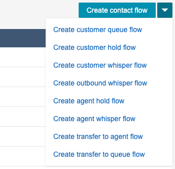

In the new Contact Flow screen, select Import, and then select the file
downloaded from [HERE](./outbound-sms/assign-to-agent)

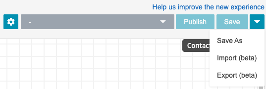
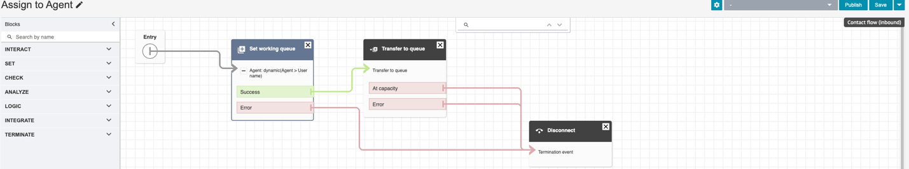

Finally, select Save and Publish, setting the name or noting the name of
the Contact Flow

This completes the creation of the Contact Flow required by ConnectPath
for originating SMS/MMS messages from ConnectPath to Twilio.

Setup Contact Flow in ConnectPath for Outbound Usage

This step will set the Contact Flow, created in the previous step, as
the default one utilized when originating an SMS/MMS message from
ConnectPath.

Under Settings, Instance Details, set the Outbound messages toggle to
Yes and select the Contact Flow previously created (default name is
"Assign to Agent"):

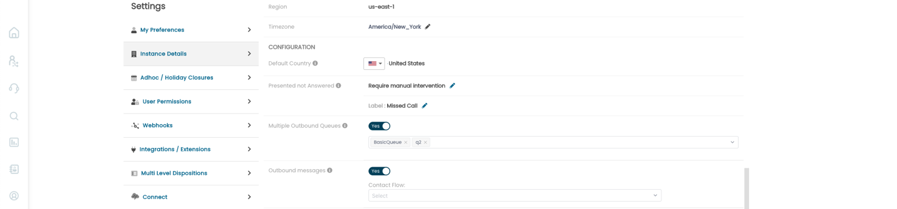

Upon selecting the Contact Flow, the preference should be saved
automatically, and no additional steps are required to enable the
functionality.

This concludes the setup steps required to enable Two Way SMS/MMS with
Twilio in ConnectPath.
