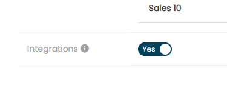
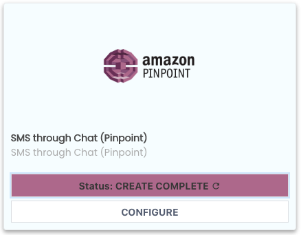
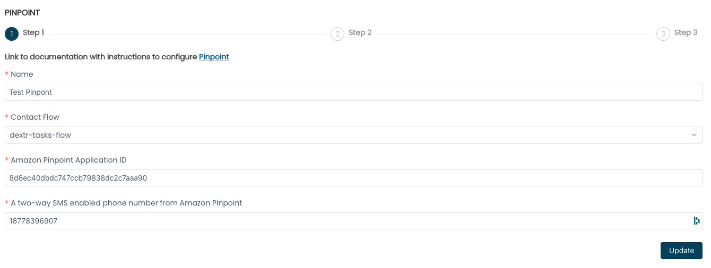
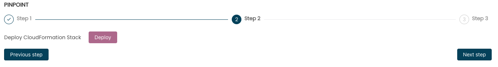
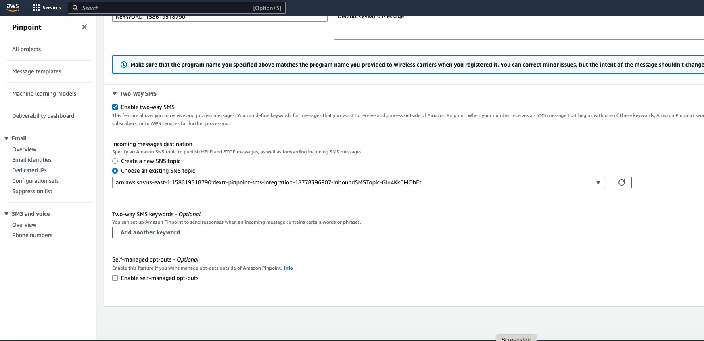

This document will walk you through the initial setup of Pinpoint and
ConnectPath to support the receipt of SMS messages from Pinpoint into
ConnectPath. ConnectPath now supports the integration of Amazon Pinpoint
and ConnectPath via Amazon Connect Chat. This is a change in approach
from our other "Webhook" based integrations, such as Twilio that use
Tasks. With Chat, we can natively store and analyze the transcript as
well as perform advanced routing of the request through Contact Flows,
including ones with Lex. Pinpoint provides an alternative to other SMS
providers in that it's fully integrated into AWS, does not requiring an
establish account and usage is charged on demand to the same AWS account
as your Amazon Connect Instance.

For conciseness, the steps in signing up for creating the Pinpoint
Project, requesting a number, registering a number and exiting the
Pinpoint sandbox are not covered here, however, in a future release,
we will support, where possible, the automatic execution of these
steps. While in the Pinpoint project, note the Pinpoint Application ID
(<https://docs.aws.amazon.com/pinpoint/latest/apireference/apps-application-id.html>)
and Number (prefixed with a 1 for the country code) that you wish to
use for SMS.

Once the project is created, with the phone number, you will proceed
to the ConnectPath Settings then Instance Settings and begin the
integration steps.

The first integration step requires you to enable integrations, by
sliding the toggle to yes, as displayed below. This is located under
the dispositions section of the Instance Settings screen:

After that, you will go to the integrations screen and start the
three-step process:

Locate the Amazon Pinpoint card, note that the status will not show
create complete until you complete the three-step process. To begin,
click Configure.

On the first screen, you will give the integration a name, and then
enter the Contact Flow, Application ID
(<https://docs.aws.amazon.com/pinpoint/latest/apireference/apps-application-id.html>)
and Number (prefixed with a 1 for the country code) previously noted. As
this creates a Chat Contact, you'll want to use a Contact Flow designed
for Chat and not voice (e.g. shouldn't ask for DTMF, etc.). The out of
the box Contact Flow is suitable for test or customization purposes.

Once done and you click next step, you'll be presented with the option
to deploy the CloudFormation Stack:

Upon clicking Deploy you will be taken to a new browser window, in which
you can deploy the integration CloudFormation Stack, like how you
deployed the baseline ConnectPath CloudFormation Stack when you
onboarded your Amazon Connect Instance to CloudFormation.

Follow the steps in the CloudFormation console and when deployment has
finished, you can go back to the ConnectPath screen you left off on,
Click Next and then Validate. Once status shows Create Complete you may
click Finish, which finishes the three-step process:

The CloudFormation stack creates additional AWS Resources in your Amazon
Connect Account required to send and receive SMS messages between the
Pinpoint number in your Pinpoint project and ConnectPath. One of these
resources is an SNS Topic that you will need to point the number to.

To do that, go to the Pinpoint Project and the number, check the Enable
two-way SMS box and select the Incoming messages destination of
\"...InboundSMSTopic...\":

This concludes the setup steps required to enable Two Way SMS/MMS with
Twilio in ConnectPath.
