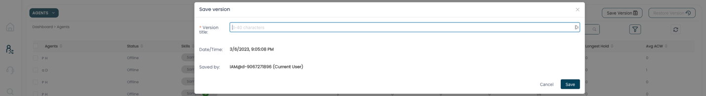
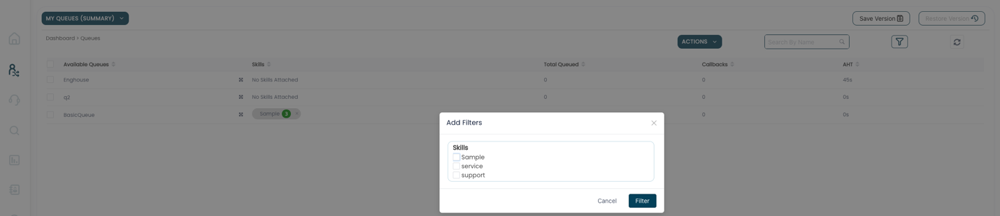
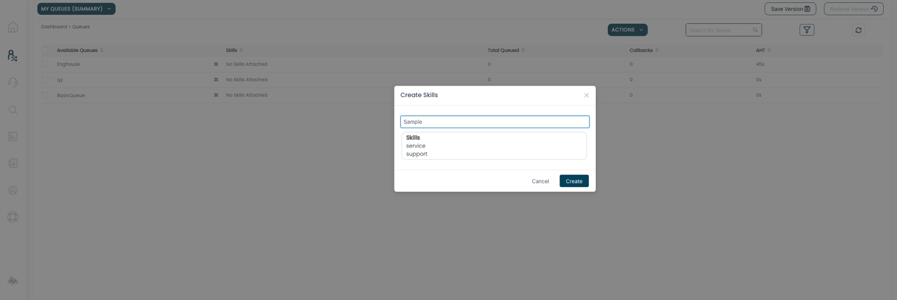
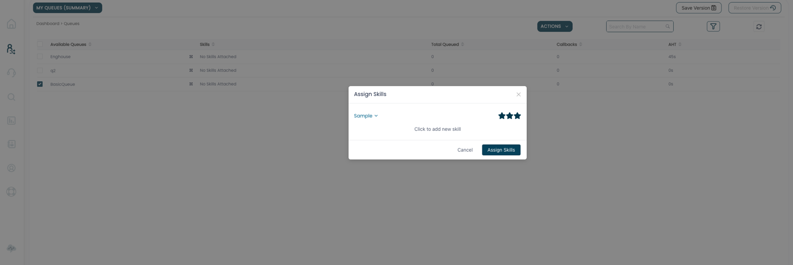
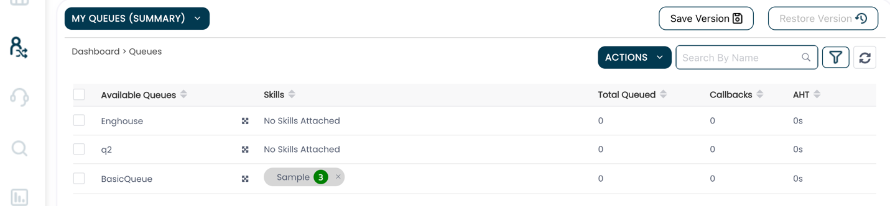
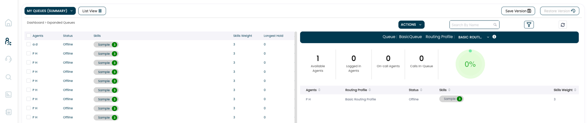

Queue Management, allows users, from a single screen, see the current
state of their queues, agents associated with those queues (via routing
profiles), and change, if needed, the routing profile that one or more
agents of those queues are associated with.

Before you can take advantage of the feature, you will need to do the
following:

1)  Save a version, which is essentially a snapshot of the current
    agent, routing profile and queue configuration. The purpose of
    Saving a version is to allow you to restore the saved version in the
    event you wish to undo a change made through the feature

2)  Define Skills and map those Skills to Agents and Queues

Save a version

As mentioned above, Save a version allows you to create a snapshot of
the current agent, routing profile and queue relationships so that they
may be reverted as a quick undo to any changes made in the feature.
Please note that while we currently support saving a version, restoring
that saved version is not yet available, but will be in the April 2023
release of ConnectPath.

Define Skills and map those Skills to Agents and Queues

A Skill is an arbitrary tag that can be assigned to one or more agents
and one or more skills, it has a "3 star" measure that allows you to
indicate how important that skill is to the queue and the agent's
proficiency in the skill.

The skill is used as a filter, primarily when identifying agents who can
handle the type of contact required by a queue, but are not a part of
the queue, so that they may be assigned to that queue, via a routing
profile.

The filter can be accessed from either the agents or queues screens:

First, you'll define a Skill, which can be achieved by selecting
Actions, Create skills:

After you've defined a skill, you'll assign that skill to a queue.

You can accomplish that by selecting one or more skills, then Actions,
Assign Skills. This let's you choose which skills you wish to assign and
high how high that skill is valued within ConnectPath (for filtering
purposes):

After you've assigned the skill to the queue, you will then need to
assign that skill to one or more agents. You can change to the agents
view by clicking My Queues (Summary) and selecting Agents. The process
of assigning skills to agents is the same as it is with Queues. While in
the Agents view, you'll select Actions, Assign Skills. This let's you
choose which skills you wish to assign and high how high that skill is
supported by the selected agents, which again, is used for down
filtering candidate agents when potentially making a change to the
queue's staffing:

Once the preceding steps are completed, basic use of the feature follows
the following flow:

First you will identify the queue you wish to change agent assignments,
which you can accomplish by optionally filtering and observing the
metrics of the queues:

Once you have identified the queue, you can click the "4 arrow square"
to drill into the details of the queue, including associated routing
profiles and current agents (on the right), and candidate agents, based
on skills to the left:

Within the details screen, you will also be able to see metrics of the
agents as well as the queues, to further refine which agents you wish to
move and how many you wish to move based on desired impact to the queue
the agents are being moved from, and the queue the agents are being
moved to.

If you wish to assign one or more agents to a routing profile, you may
select them, individually or in bulk, and then drag them to the
queue/routing profile from left to right.

When hovering over the queue/routing profile you will be given the
option to "move" or "copy".

Copy will move the agents to an entirely new routing profile
(ConnectPath will create that routing profile) and assign the
queue/agents to it.

Move will utilize the existing routing profile and simply update the
agents' current routing profile to use that one.

Once completed, you'll see those moved or copied agents displayed in the
right pane:

That completes the basic operations of Queue Management.
