### Smart Replies

ConnectPath allows users and administrators to specify pre-canned
scripts, or responses for use in Omnichannel contacts such as SMS,
E-Mail, or Chat conversations. These pre-canned scripts support both
fixed value and attribute value substitution.

ConnectPath also allows administrators to enable "Smart Replies", which
uses Generative AI to recommend three responses to an agent in response
to the agent asking for a Smart Reply to be generated for a given block
of text.

This capability uses Amazon Bedrock, against your existing AWS Account,
and therefore your data remains within your AWS Account. Usage costs
associated with the use of the service will accordingly be charged
against your AWS Account as well.

Given there is additional (AWS) cost for use of the service, to enable
the feature you will need to assign the permission, via one or more
permission groups in ConnectPath, as well as subscribe to one of more
Foundational Models through the Amazon Bedrock console.

This document will walk through the steps required to enable the
feature, as well as demonstrate the agent experience once the feature
has been enabled.

Setup of Smart Replies

As many of the Foundational Models used by Amazon Bedrock are supplied
by third parties (and billed via AWS), you must first subscribe to the
Foundational Model used by the Smart Reply feature.

Log into the Amazon Bedrock Console, in the AWS Account that your Amazon
Connect instance is in with the following URL:
<https://console.aws.amazon.com/bedrock>

You will see a screen like the below -- note the region in the top
right-hand corner. If this is not the region your Amazon Connect
instance is in (which you can find by going to
<https://console.aws.amazon.com/connect>), change it to the appropriate
region. If the region you need is not available, refer to the end of
this document for the alternative region to use.

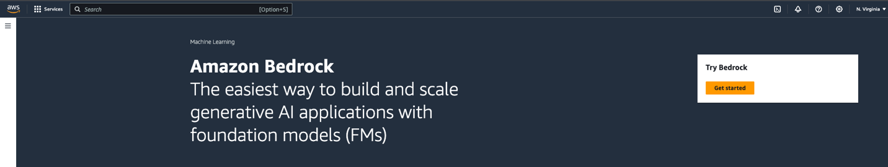

To proceed, click the Get started button and on the left-hand side of
the page, towards the bottom click model Access:

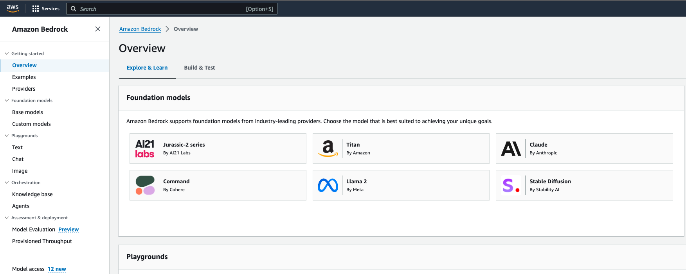

Click the Manage model access button:

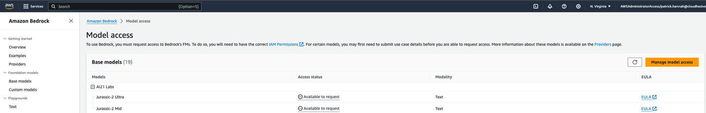

Check the box for Jurrasic-2 Mid under AI21 Labs:

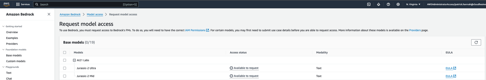

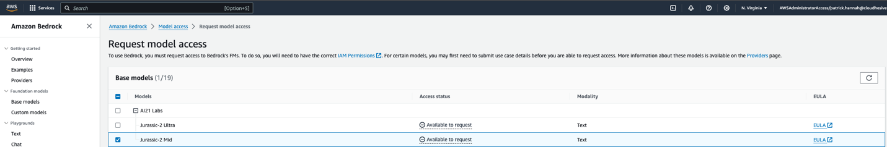

Scroll to the bottom and click Request model access:

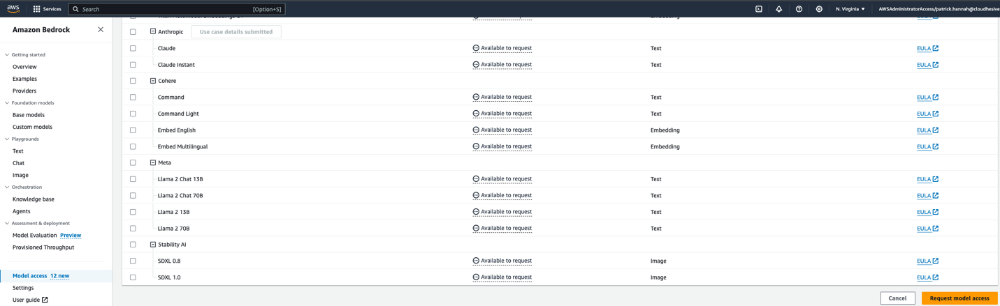

You'll see a message at the top, in Blue indicating that the Model
access request has been submitted. Press the refresh button next to
Manage model access and confirm that you see Access granted as an Access
status for the Jurassic-2 Mid model:

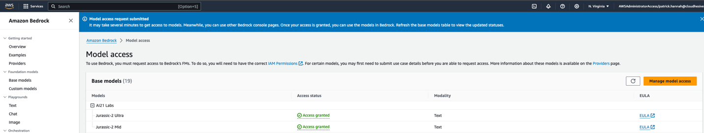

After that has been completed, within ConnectPath (log in if you are not
already logged in), click the Gear to go to Settings, then click User
Permissions. Select the Permission Group that you wish to give access
to:

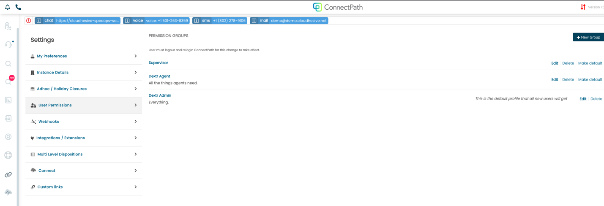

After that scroll down to Communications and Presence section and find
the Smart Replies row and check the box to enable (or disable) the
feature:

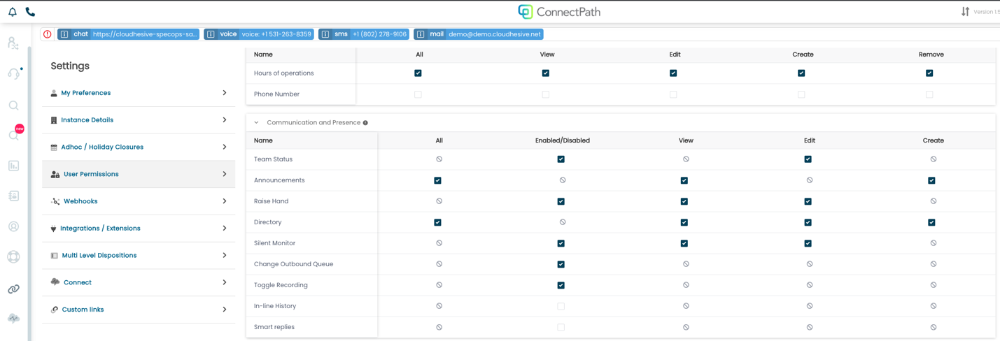

After that, users will be able to start using Smart Replies.

Use of Smart Replies

Once the feature has been enabled when an agent receives an SMS or Chat
message, they may click on the message bubble to generate a Smart reply:

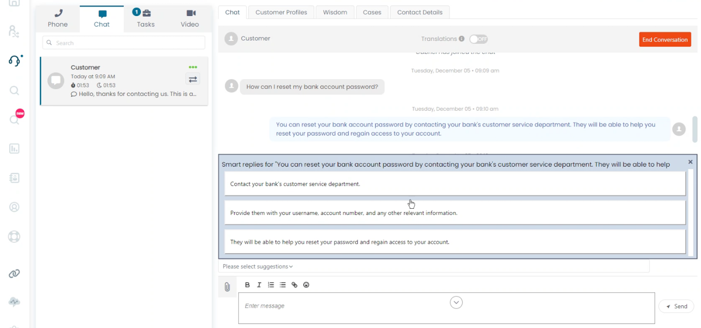

Upon clicking on one of the responses, it will be pasted into the
message box but not sent to the customer, this allows you to further
refine the response, if needed:

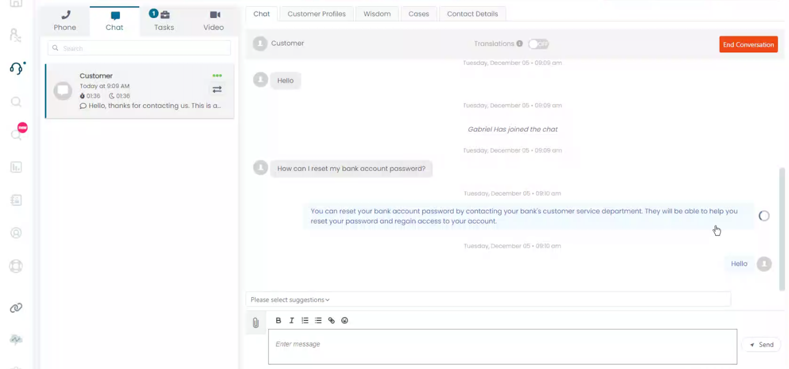

Given the nature of E-Mail threads, Smart Replies in E-Mail are slightly
different in use but conceptually the same.

The text that you wish to generate a Smart Reply for must first be
selected, then the Smart Reply button clicked to generate suggestions:

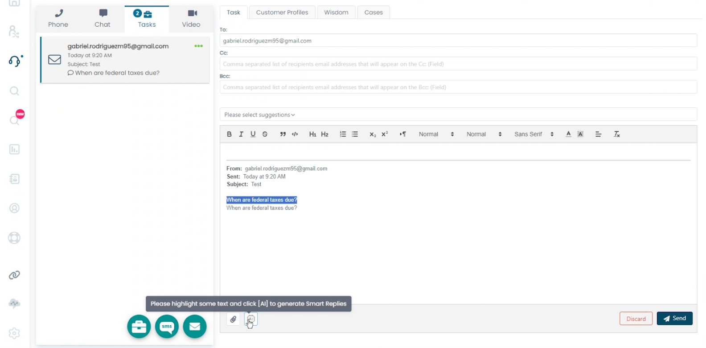

Like SMS and Chat, three suggested Replies will be generated:

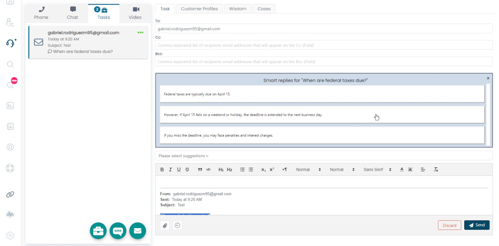

Upon selecting one, it will be pasted into the body of the E-Mail, but
not sent, allowing you to further refine it:

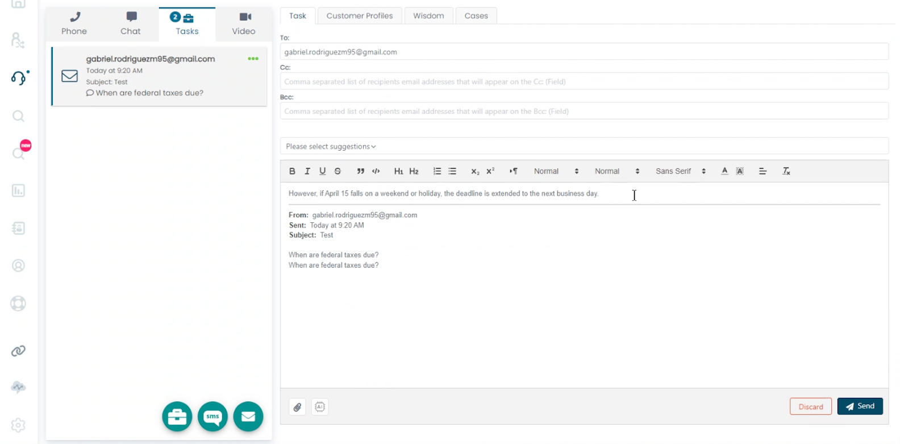

This completes setup and use of the Smart Replies feature.

A few notes about this feature:

Availability of Amazon Bedrock and the Foundational Models available to
subscribe to for use with Amazon Bedrock will vary by region. If we find
that your instance is in a region without the requisite Amazon Bedrock
service or the Foundational Model, we will use the next closest region
as an alternative based on this table:

\"ap-northeast-2\" will use \"ap-southeast-1\",

\"ap-southeast-2\" will use \"ap-southeast-1\",

\"ca-central-1\" will use \"us-east-1\",

\"eu-central-1\" will use \"us-east-1\",

\"eu-west-2\" will use \"us-east-1\",

All other instance regions will use the Amazon Bedrock service within
the same region.

We have selected a Foundational Model of AI21 Studio Jurassic-2 Mid
Foundational Model, which balances availability, speed, accuracy, and
cost across the regions Amazon Bedrock is available in, but also, on a
case-by-case basis support overriding both the Foundational Model and
certain parameters by request (via our Support team).

Finally, given the nature of Generative AI, we expect Foundational Model
capabilities to rapidly increase over time, and anticipate support for
those new capabilities, including customization of Foundational Models,
augmenting of Foundational Models via Retrieval Augmented Generation
and/or prompt engineering. As these capabilities our introduced, we will
update both this documentation as well as the release notes.
