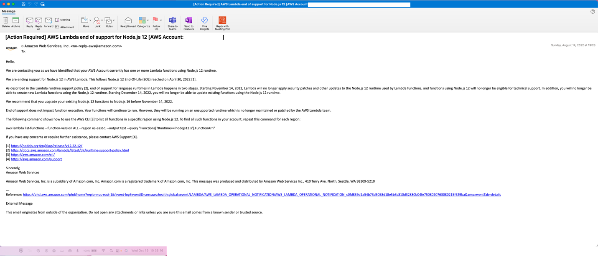
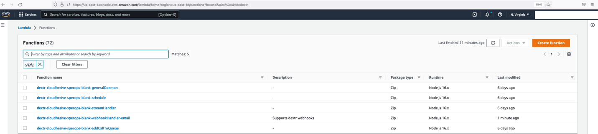
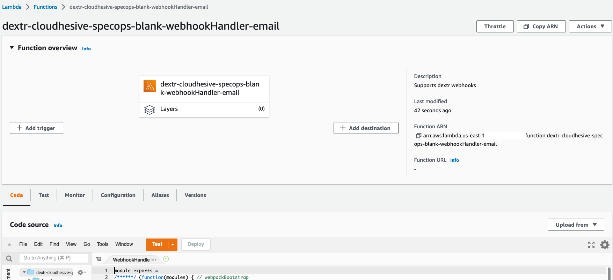
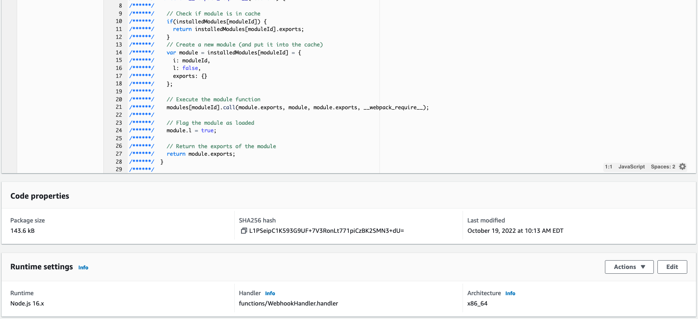
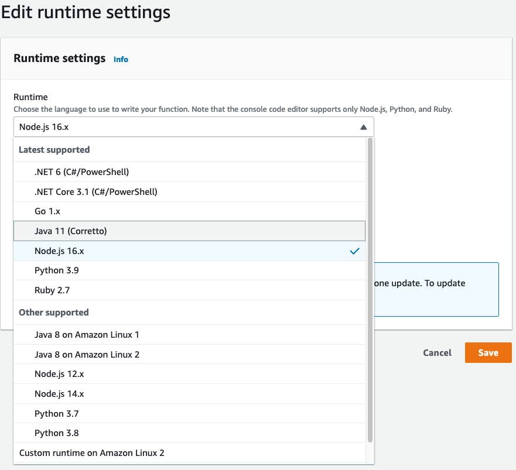
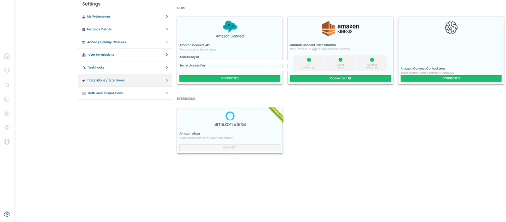
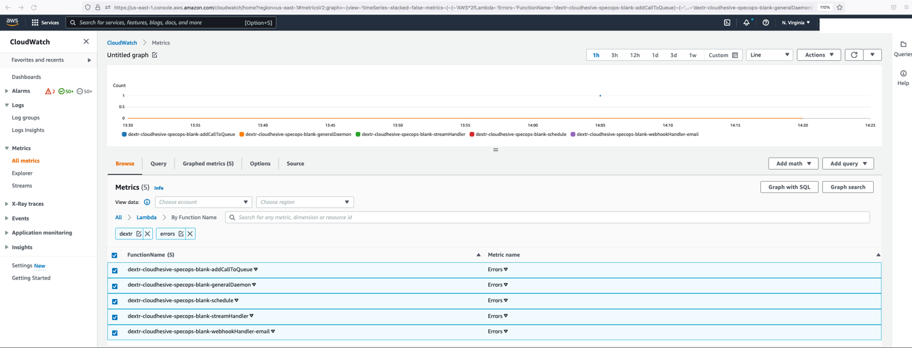

# Updating Dextr Lambda Function Runtime Version

If you've received an E-Mail like the below, and wish to act on it, you
may update the Lambda Function Runtime version used by the Dextr Lambda
Functions from Node.js 12 to Node.js 16 using the steps contained within
this document:

Note that if you do not update the Lambda function runtime version, the
Lambda functions will continue to operate as normal, but the Node
runtime in question will not receive security updates, nor will AWS
provide support on the Lambda functions.

At a future date, Dextr will provide the functionality to auto-update
the runtime as needed, however, the effort required in updating the
runtime is envisioned to take no more than 15 minutes.

This work can be performed at anytime without impact to your Amazon 
Connect instance, however, we recommend making the change during a 
predetermined window during a low volume period, if possible.

The first step is to identify the Lambda functions in question, and what
their current runtime versions are. You can do this by going to the
Lambda AWS Console (<https://console.aws.amazon.com/lambda>) in the same
AWS Account and AWS Region that your Amazon Connect instance is in,
typing Dextr in the search box and pressing enter. The result should be
like the result below:

If you have multiple Amazon Connect instances using Dextr you will
notice that for each of those instances, the same set of 4 (or 5 if you
are using E-Mail Webhooks) Lambda functions will be displayed. In that
case the steps remain the same but must be repeated for all listed
Lambda functions on the older runtime (in this case Node.js 12.x).

Click on each instance to open the details, and you will find a screen
like the below:

Scroll down to the bottom of the screen and look for a section called
"Runtime settings" and click Edit:

Once you click Edit, select the Runtime dropdown and you will be
presented a list of options. The option currently selected is Node.js
12.x in this case and you will want to select Node.js 16.x instead. Once
selected you will click Save.

As indicated above, this step will need to be recreated for each of the
"Dextr" Lambda functions that utilize the "end of support" runtime
version.

After the change has been made, you will want to validate the following
functions within Dextr continue to work:

-   Live Look

-   Contact Flows that utilize Dextr managed Schedules

-   E-Mail Flows (if your instance uses E-Mail)

-   The Integration Panel under Settings:

You may also review the individual Error status of each of the Lambda
functions by going to the CloudWatch AWS Console
(<https://console.aws.amazon.com/cloudwatch>) in the same Region as the
Lambda functions and selecting Metrics \> All Metrics \> Lambda \> By
Function Name and filtering on "Dextr" and "Errors":

If you find any of the functions are returning errors, you may reach out
to our team for assistance.

After completing the above steps, no further action is required.
