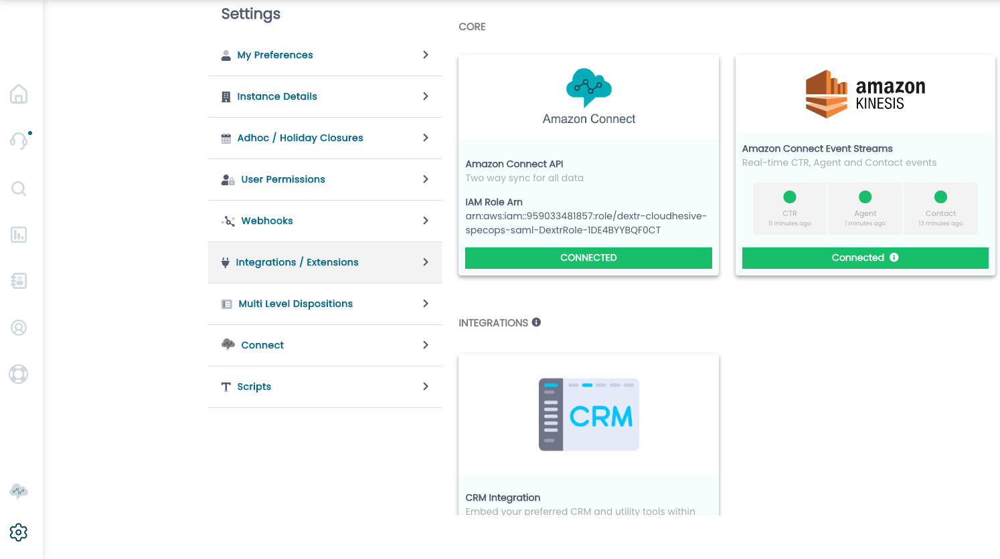
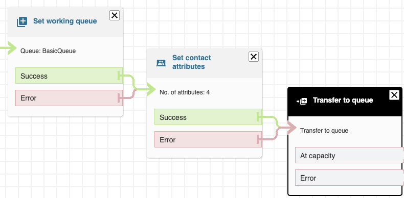
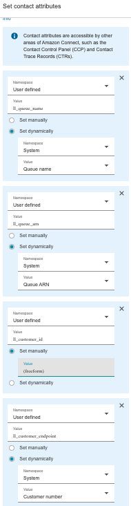
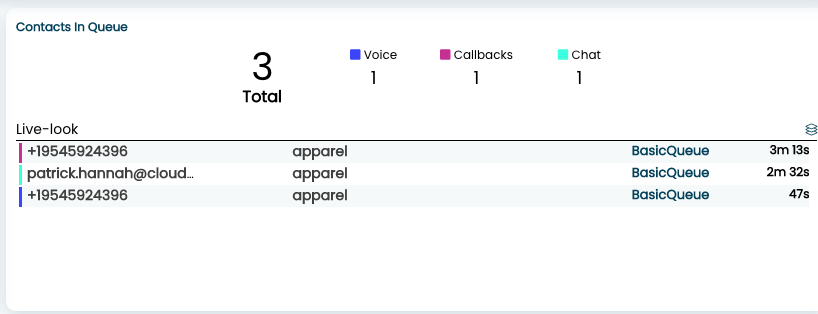
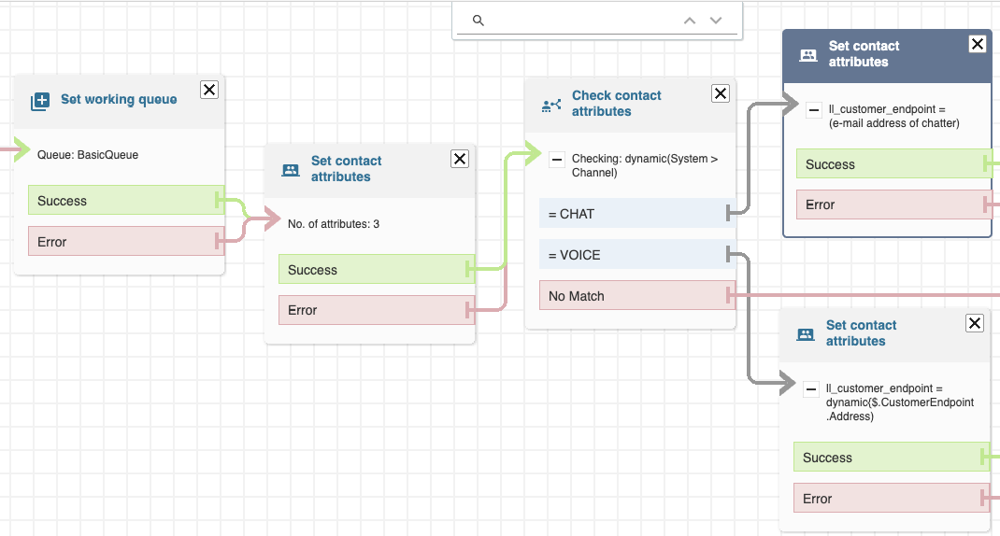
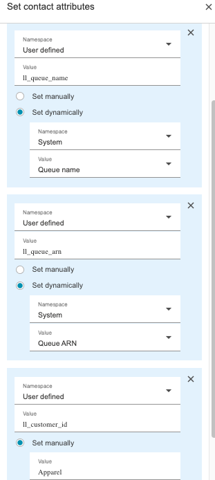
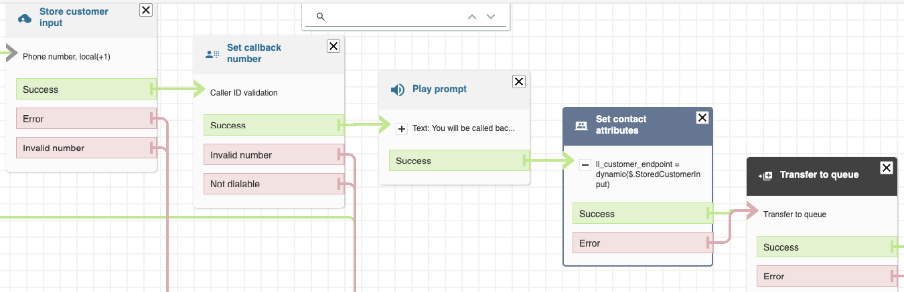
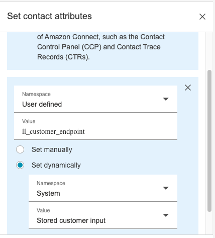

Prior to January 10th, 2023, your Amazon Connect Contact Flows needed
to invoke a Lambda Function (addCallToQueue) after setting the queue and
immediately before transferring to said queue to provide accurate
information in Live Look -- including counts and contact details.

Similarly, at the time of onboarding your Amazon Connect Instance on to
ConnectPath, an Event Bridge rule was required to send Amazon Connect events
to the Kinesis Stream ingested by ConnectPath. This ensured both the
timeliness of events (such as calls being routed to queue and
subsequently answered by an agent) as well as the depth of data in those
events (which was provided by the above referenced Lambda Function.

You can verify the Event Bridge Rule, Connect Instance, Kinesis Streams
and Lambda functions are healthy by clicking the Gear Icon and selecting
Integrations / Extensions. Under Amazon Kinesis you should see three
green traffic lights as displayed below:

With January 10th, 2023's release (0.9.96c) the addCallToQueue Lambda Function
is no longer required (the Event Bridge rule remains required), and has
instead been replaced with 4 User defined attributes.

These User defined attributes provide improvements over the Lambda
Function by:

1)  Reducing Costs -- one less Lambda Function requiring invocation

2)  Increasing Flexibility -- you can define the Caller's Endpoint, the
    Queue Name/ARN and a Floating Attribute of your choosing

3)  Increased Reliability -- certain contact conditions (such as
    Callbacks) would not invoke the Lambda Function, requiring us to
    fall back on other mechanisms to identify Callbacks

The name and purpose of these attributes is as follows (note that ll is two lower case letter L's):

-   User defined key ll_queue_name value of System Queue Name

-   User defined key ll_queue_arn value of System Queue ARN

-   User defined key ll_customer_endpoint value of System Customer
    Endpoint, OR, if you are using callbacks, User defined value of the
    entered callback number, OR if you are using Chat, User defined
    value provided in the chat request

-   User defined key ll_customer_id value of your choosing

These can be implemented in-line in your Contact Flows, or a Contact
Flow module (recommended) and can be scenario based to cover Inbound
Voice (normal course of action), Callback (where you may choose to
utilize the caller-entered phone number) or Chat (where you may choose
to map an attribute sent in the chat request as the caller's endpoint).

Common scenarios we find with customers wishing to use the
ll_customer_id key would be to indicate a specific customer's name or
account, or a line of business within your organization.

A simplistic example of a Contact Flow in which a Queue is set,
Attributes are set and the Contact is Transferred to Queue looks like
this:

An exploded view of how the 4 contact attributes are set looks like
this:

And finally, an example of the Live Look screen, with all four
attributes defined, with three types of contacts in queue looks like
this:

An advanced version of the Contact Flow, in which you override the
Customer Endpoint based on the Channel it comes in on looks like this:

Note in the above screenshot we set 3 of the 4 contact attributes before
branching based on the Channel, and once branched on the Channel we set
the final attribute, the customer endpoint.

An exploded view of how the 3 contact attributes are set looks like
this (the 4th, set in another block, has been omitted for brevity).

Similarly, to address cases where a customer may provide a callback
number that differs from the number that the customer called in on, the
following would be done in the Customer queue flow:

Note that we do not have to set all 4 attributes as they were set in the
inbound flow and only one needs to be overridden (ll_customer_endpoint).

An exploded view of how the 1 contact attribute is set looks like
this:

